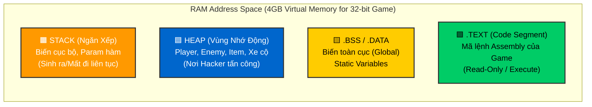
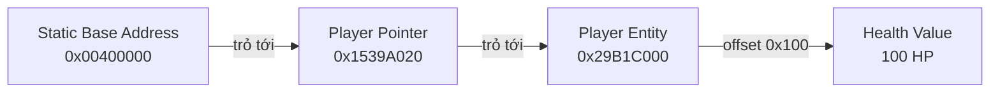

# [VN] CheatDev Book: FULL VERSION

**Generated at:** 2/19/2026, 12:57:54 PM

---

# 📘 [VN] CheatDev Book: Từ Zero đến Hero

**Tác giả:** Antigravity (Google DeepMind) & User
**Nhà Xuất Bản:** VTech Digital Solution
**Phiên bản:** 1.0 (Legendary Edition)

Chào mừng bạn đến với cuốn sách giáo khoa toàn diện nhất về **Game Hacking**, **Reverse Engineering** và **An Ninh Mạng**.
Đây không chỉ là lý thuyết. Đây là bản đồ kho báu dẫn bạn đi từ những khái niệm cơ bản nhất của máy tính đến tận cùng của Kernel Hệ điều hành.

> ⚠️ **TUYÊN BỐ MIỄN TRỪ TRÁCH NHIỆM**
> Kiến thức trong sách này nhằm mục đích nghiên cứu bảo mật và giáo dục.
> Tác giả không chịu trách nhiệm cho bất kỳ hành vi vi phạm pháp luật nào của người đọc.

---

## 🏛️ LỜI NÓI ĐẦU (PREFACE)

Chào mừng bạn đến với thế giới của những con số Hexadecimal và những dòng lệnh Assembly.
Cuốn sách này được biên soạn với triết lý: **"Tư duy quan trọng hơn Công cụ"**.

Trong kỷ nguyên số, **Game Security** là một trong những lĩnh vực khó nhất của An toàn thông tin. Nó là cuộc đua không hồi kết giữa Hacker (Red Team) và Developer (Blue Team). Để chiến thắng, bạn không thể chỉ dựa vào tool có sẵn. Bạn phải hiểu tường tận từng bit, từng byte trong bộ nhớ.

Cuốn sách này sẽ dẫn bạn đi một hành trình dài:
1.  Từ **User Mode** xuống **Kernel Mode**.
2.  Từ **Code C++** bậc cao xuống **Assembly** bậc thấp.
3.  Từ **PC (x86)** sang **Mobile (ARM64)**.

Hãy chuẩn bị một cái đầu lạnh và một cốc cà phê nóng. Hành trình bắt đầu ngay bây giờ.

---

## 📑 MỤC LỤC (Table of Contents)

### 🧱 PHẦN 1: KHOA HỌC & NỀN TẢNG
*   **[Chương 1: Nền Tảng Tư Duy (The Mindset)](./01_Nen_Tang_Tu_Duy/README.md)**
    *   Cấu trúc bộ nhớ (RAM, Stack, Heap).
    *   Hệ thập lục phân (Hex) và Binary.
    *   Ngôn ngữ C/C++ và Con trỏ (Pointers).

*   **[Chương 2: Công Cụ Thần Thánh (The Tools)](./02_Cong_Cu_Than_Thanh/README.md)**
    *   Cheat Engine (Quét Memory).
    *   ReClass.NET (Phân tích Struct).
    *   x64dbg / IDA Pro (Cơ bản).

### ⚔️ PHẦN 2: KỸ THUẬT HACK CƠ BẢN (USER MODE)
*   **[Chương 3: External Hacking (Ngoại Khoa)](./03_Lap_Trinh_External/README.md)**
    *   Windows API (`ReadProcessMemory`, `WriteProcessMemory`).
    *   Vẽ Overlay ESP (World to Screen).

*   **[Chương 4: Internal Hacking (Nội Khoa)](./04_Lap_Trinh_Internal/README.md)**
    *   DLL Injection (Tiêm mã).
    *   Function Hooking (MinHook, Detours).
    *   DirectX/OpenGL Hooking (Menu ImGui).

### 📱 PHẦN 3: MOBILE SECURITY
*   **[Chương 5: Mobile Hacking (Android/iOS)](./05_Mobile_Hacking/README.md)**
    *   Cấu trúc APK, DEX, Native Library (`.so`).
    *   Modding Game Unity (IL2CPP) và Cocos2d-x.
    *   Sử dụng Frida để Hook Runtime.

### 🔬 PHẦN 4: PHÂN TÍCH CHUYÊN SÂU (REVERSE ENGINEERING)
*   **[Chương 6: Reverse Engineering Advanced](./06_Reverse_Engineering_Advanced/README.md)**
    *   Phân tích Tĩnh (Static) với IDA Pro / Ghidra.
    *   Phân tích Động (Dynamic) và Tracing.
    *   Unpacking (Gỡ rối) và Decryption.

### 🌐 PHẦN 5: NETWORK SECURITY
*   **[Chương 7: Networking & Packet Hacking](./07_Networking_Packet_Hacking/README.md)**
    *   Phân tích gói tin với Wireshark.
    *   Chặn và sửa gói tin (WPE Pro / MitM).
    *   Mã hóa và Bảo mật đường truyền.

### 🛡️ PHẦN 6: KERNEL & ANTI-CHEAT (GOD MODE)
*   **[Chương 8: Kernel Driver Development](./08_Kernel_Driver_Development/README.md)**
    *   Lập trình Driver (`.sys`) ở Ring 0.
    *   Giao tiếp IOCTL giữa User và Kernel.
    *   Đọc bộ nhớ vật lý.

*   **[Chương 9: Anti-Cheat Evasion](./09_AntiCheat_Evasion/README.md)**
    *   Cơ chế hoạt động của BattlEye, EAC, Vanguard.
    *   Bypass Signature và Heuristic Scan.
    *   HWID Spoofing (Giả mạo phần cứng).

### 🏆 PHẦN 7: THỰC CHIẾN (PROJECTS)
*   **[Chương 10: Final Projects](./10_Final_Projects/README.md)**
    *   Tổng hợp các bài tập lớn để tốt nghiệp.
    *   Xây dựng Mod Menu hoàn chỉnh.
    *   Viết Driver ẩn mình.

---
*"Stay Hungry. Stay Foolish. Stay Undetected."*


---

# Chương 1: Nền Tảng Tư Duy (The Mindset) 🧠

*"Để hack được Matrix, bạn phải nhìn thấy Matrix."*

Chào mừng đến với chương đầu tiên. Ở đây, chúng ta sẽ không học cách dùng tool hack ngay. Chúng ta sẽ học cách **máy tính suy nghĩ**.

---

## 1.0. Chuẩn Bị Trang Bị (Setup Môi Trường) 🛠️
Trước khi ra chiến trường, bạn cần vũ khí. Hãy tải và cài đặt ngay:

1.  **Visual Studio Community (2022)**: IDE lập trình C++ tốt nhất trên Windows.
    *   *Link:* [visualstudio.microsoft.com](https://visualstudio.microsoft.com/vs/community/)
    *   *Lưu ý:* Khi cài đặt, nhớ tích vào ô **"Desktop development with C++"**.
2.  **Cheat Engine (8.x)**: "Dao mổ" để soi RAM game.
    *   *Link:* [cheatengine.org](https://www.cheatengine.org/)

---

## 1.1. Bộ Nhớ Máy Tính (RAM) - Chiến Trường Chính
Khi một game chạy (ví dụ: CS2, LoL, GTA), toàn bộ dữ liệu của nó (Máu, Đạn, Tọa độ, Tên nhân vật) đều phải được nạp vào **RAM**.
Hacker không thể sửa đổi đĩa cứng để hack máu tức thì. Hacker sửa **RAM**.

### Cấu trúc của RAM
Hãy tưởng tượng RAM là một thành phố khổng lồ.
*   Mỗi ngôi nhà là một **Byte**.
*   Mỗi ngôi nhà có một số nhà duy nhất gọi là **Địa chỉ (Address)**. Ví dụ: `0x00400000`.
*   Bên trong ngôi nhà chứa **Giá trị (Value)**.

### Sơ Đồ Bộ Nhớ (Memory Segment Visualization)

Hãy xem cách Game phân bổ bộ nhớ:



1.  **Code Segment (.text):** Chứa mã lệnh của game (Assembly). Đây là nơi chứa logic "Nếu hết máu thì chết". Hacker sửa ở đây gọi là **Code Injection**.
2.  **Data Segment (.data):** Chứa các biến toàn cục (Global variables) cố định.
3.  **Stack:** Vùng nhớ ngăn xếp, dùng cho các biến cục bộ (Local variables) trong hàm. Nó sinh ra và mất đi liên tục.
4.  **Heap:** Vùng nhớ động. Đây là nơi chứa Nhân vật, Xe cộ, Item. **99% dữ liệu game nằm ở đây**.

---

## 1.2. Hệ Thập Lục Phân (Hexadecimal)
Tại sao Hacker luôn dùng `0x`?
*   Con người dùng hệ 10 (0-9).
*   Máy tính dùng hệ 2 (0-1).
*   Hệ 16 (Hex) là cách viết tắt hoàn hảo cho hệ 2. Một ký tự Hex đại diện cho 4 bit.

**Bảng quy đổi:**
| Dec | Hex | Binary | Ghi chú |
| :--- | :--- | :--- | :--- |
| 0 | 0 | 0000 | |
| 10 | A | 1010 | |
| 15 | F | 1111 | Max 4-bit |
| 16 | 10 | 0001 0000 | |
| 255 | FF | 1111 1111 | Max 8-bit (1 Byte) |

**Quy tắc:** Mọi địa chỉ bộ nhớ đều viết dưới dạng Hex (VD: `0xDEADBEEF`).

---

## 1.3. Kiểu Dữ Liệu (Data Types)
Máy tính không biết "Máu" là gì. Nó chỉ biết các ô nhớ. Bạn phải biết game dùng kiểu dữ liệu gì để quét cho đúng.

1.  **Byte (1 byte):** Số nhỏ (0-255). Thường dùng cho `Team ID` (1=CT, 2=T), `Level`.
2.  **Word / Short (2 bytes):** Số vừa (-32k đến 32k). Ít dùng.
3.  **Integer / Dword (4 bytes):** Số nguyên (-2 tỷ đến 2 tỷ). **Đa số Máu, Đạn, Tiền dùng kiểu này.**
4.  **Float (4 bytes):** Số thực có dấu phẩy (100.5). **Tọa độ (X, Y, Z) luôn luôn là Float.**
5.  **Double (8 bytes):** Số thực siêu lớn. Dùng trong game Engine xịn (Unreal 5) hoặc game Web (JS).

---

## 1.4. Con Trỏ (Pointers) - Bản Đồ Kho Báu
Đây là khái niệm giết chết 90% người mới học. Hãy chú ý.

Trong lập trình hiện đại, biến Máu **không bao giờ** nằm yên một chỗ. Mỗi lần bạn mở game, Windows sẽ cấp cho Máu một địa chỉ nhà mới (cơ chế ASLR - Address Space Layout Randomization).
Nếu bạn tìm ra địa chỉ Máu hôm nay, ngày mai nó sẽ sai.

**Giải pháp:** Game phải lưu lại địa chỉ mới đó vào một chỗ cố định. Chỗ đó gọi là **Con Trỏ (Pointer)**.
Con trỏ là một biến đặc biệt: Giá trị của nó không phải là số lượng, mà là **địa chỉ của biến khác**.



**Chuỗi Pointer (Pointer Chain):**
Game thường giấu dữ liệu qua nhiều tầng trỏ:
`Module Base Address` -> `World Pointer` -> `Player Array` -> `My Player` -> `Health`.
Hacker phải dùng Cheat Engine để lần ngược (Reverse) chuỗi này (Pointer Scan).

---

## 1.5. Bài Tập Thực Hành (Lab 1)
Bạn không thể hack game nếu không biết tạo ra game. Hãy viết một "Game giả" bằng C++ để làm chuột bạch.

### Code: `DummyGame.cpp`
```cpp
#include <iostream>
#include <windows.h>
#include <string>

// Một Class mô phỏng nhân vật game
struct Player {
    int id;
    char name[32];
    int health; // Máu (Offset 0x24)
    int ammo;   // Đạn (Offset 0x28)
};

int main() {
    SetConsoleTitleA("Dummy Game for Hacking");
    
    // Cấp phát động (Heap) - Mô phỏng game thật
    Player* myPlayer = new Player();
    myPlayer->id = 1;
    strcpy_s(myPlayer->name, "HackMePlz"); // Dùng strcpy_s an toàn hơn
    myPlayer->health = 100;
    myPlayer->ammo = 30;

    // In ra địa chỉ để người học đối chiếu (Trong thực tế Game sẽ không in cái này!)
    std::cout << "--- DEBUG INFO ---" << std::endl;
    std::cout << "Base Pointer (Stack):    0x" << std::hex << (uintptr_t)&myPlayer << std::endl;
    std::cout << "Player Address (Heap):   0x" << std::hex << (uintptr_t)myPlayer << std::endl;
    std::cout << "Health Address (Actual): 0x" << std::hex << (uintptr_t)&myPlayer->health << std::endl;
    std::cout << "------------------" << std::endl;

    while (true) {
        std::cout << "Game Loop: Health = " << std::dec << myPlayer->health 
                  << " | Ammo = " << myPlayer->ammo << std::endl;

        // Giả lập logic game: Hồi máu nếu thấp, mất máu nếu > 0
        if (myPlayer->health > 0) myPlayer->health--;
        if (myPlayer->health <= 0) std::cout << "YOU DIED!" << std::endl;
        
        Sleep(1000); // Nghỉ 1 giây
    }
    
    return 0;
}
```

### Hướng Dẫn Compile & Chạy (Step-by-Step):

1.  **Bước 1:** Mở Visual Studio 2022. Chọn **"Create a new project"**.
2.  **Bước 2:** Chọn **"Empty Project (C++)"** -> Next -> Đặt tên `DummyGame` -> Create.
3.  **Bước 3:** Ở cửa sổ bên phải (Solution Explorer), chuột phải vào **Source Files** -> **Add** -> **New Item**.
4.  **Bước 4:** Chọn **C++ File (.cpp)**, đặt tên `DummyGame.cpp` -> Add.
5.  **Bước 5:** Copy toàn bộ code ở trên dán vào.
6.  **Bước 6:** Bấm **F5** (hoặc nút Play xanh lá ▶️) để chạy.
7.  **Kết quả:** Một cửa sổ đen xì (Console) hiện lên với dòng chữ "Game Loop...". Chúc mừng, bạn đã tạo ra con game đầu tiên để hack!

---

👉 **Bài tập về nhà:** Mở Cheat Engine lên, Attach vào Process `DummyGame.exe` và thử tìm giá trị `health` trước khi nó tụt về 0!


---

# Chương 2: Công Cụ Thần Thánh (God's Toys) 🛠️

*"Người thợ giỏi không đổ lỗi cho công cụ, nhưng người thợ tồi thì không biết dùng công cụ."*

Để hack game, bạn cần những đôi mắt nhìn xuyên thấu RAM. Đây là bộ công cụ tiêu chuẩn của ngành.

---

## 2.1. Cheat Engine (CE) - Huyền Thoại
Nếu bạn chưa cài Cheat Engine, hãy cài ngay. Đừng tải bản crack, bản gốc miễn phí và mã nguồn mở.

### Các kỹ thuật quét (Scan Types)
1.  **Exact Value (Giá trị chính xác):** Bạn biết rõ số máu là 100. Quét 100. Bị bắn còn 90. Next Scan 90. -> Tìm ra ngay.
2.  **Unknown Initial Value (Giá trị khởi đầu không rõ):** Dùng cho thanh máu không hiện số (chỉ có thanh đỏ).
    *   Bắt đầu quét: "Unknown Initial Value".
    *   Mất máu -> Scan "Decreased Value" (Giá trị giảm).
    *   Hồi máu -> Scan "Increased Value" (Giá trị tăng).
    *   Đứng yên -> Scan "Unchanged Value" (Không đổi).
    *   Lặp lại đến khi còn ít kết quả.

### Pointer Scan (Tìm địa chỉ gốc)
Khi bạn tìm được địa chỉ Máu (VD: `0x12345678`), reset game nó sẽ mất. Bạn cần tìm Pointer.
1.  Chuột phải vào địa chỉ Máu -> **"Pointer scan for this address"**.
2.  CE sẽ lưu lại một bản đồ bộ nhớ (snapshot).
3.  Tắt game, mở lại. Tìm lại địa chỉ Máu mới (VD: `0x22222222`).
4.  Vào cửa sổ Pointer Scan -> **"Rescan memory"** -> Nhập địa chỉ mới `0x22222222`.
5.  CE sẽ so sánh 2 lần quét và chỉ giữ lại những đường dẫn trỏ đúng tới cả 2 địa chỉ. Đó là **Multi-level Pointer** bạn cần.

---

## 2.2. ReClass.NET - Kính Hiển Vi Cấu Trúc
Cheat Engine giúp tìm 1 giá trị. ReClass giúp bạn nhìn thấy **cả một khu phố**.

### Tại sao cần ReClass?
Lập trình viên Game thiết kế nhân vật theo **Class**:
```cpp
class Soldier {
    char pad[4];
    int Health;      // Offset 4
    int Armor;       // Offset 8
    Vector3 Position;// Offset 12 (X, Y, Z)
};
```
Trong bộ nhớ, các biến này nằm sát nhau.
Nếu bạn tìm được `Health`, chắc chắn `Armor` nằm ngay sau nó, và `Position` nằm sau `Armor`.
**ReClass** cho phép bạn nhập địa chỉ `Health` vào, và nó sẽ hiển thị các byte xung quanh dưới dạng bảng. Bạn có thể đoán ra các biến khác mà không cần tìm kiếm.

---

## 2.3. x64dbg & IDA Pro (Dành cho dân chuyên)
*   **x64dbg:** Trình gỡ lỗi (Debugger). Dùng để đặt Breakpoint. Ví dụ: Bạn muốn biết dòng code nào trừ tiền của bạn?
    *   Tìm địa chỉ Tiền.
    *   Đặt **Hardware Breakpoint on Write** (Dừng khi có ghi).
    *   Vào game mua đồ.
    *   Game sẽ "đóng băng" ngay lập tức tại dòng codeAssembly thực hiện việc trừ tiền (`SUB EAX, EBX`).
    *   Bạn có thể sửa lệnh đó thành `NOP` (No Operation - Không làm gì cả) -> Mua đồ không mất tiền.

*   **IDA Pro:** Trình phân tích tĩnh. Dùng để đọc file `.exe` hoặc `.so` khi chưa chạy game. Nó vẽ ra sơ đồ luồng đi (Flowchart) của các hàm logic.

---

## 2.4. Bài Tập Thực Hành (Lab 2)
Sử dụng `DummyGame.exe` (đã biên dịch ở Chương 1).

**Nhiệm vụ 1: Hack Máu**
1.  Dùng CE tìm địa chỉ Máu.
2.  Đóng băng (Freeze) nó cở 999.
3.  Chờ xem console có báo "YOU DIED" không.

**Nhiệm vụ 2: Tìm Offset Đạn (Ammo)**
1.  Bạn đã có địa chỉ Máu (Ví dụ: `0x00EFF964`).
2.  Trong code C++ chương 1, `Health` khai báo trước, `Ammo` khai báo sau. Cả 2 là `int` (4 byte).
3.  Theo logic: Địa chỉ Đạn = Địa chỉ Máu + 4 (`0x00EFF968`).
4.  Thử vào CE, "Add Address Manually", nhập `Địa chỉ Máu + 4`. Xem giá trị đó có phải là 30 (số đạn) không?
5.  Nếu đúng, chúc mừng bạn đã hiểu về **Struct Offset**!

[Tiếp theo: Chương 3 - External Hacking](../03_Lap_Trinh_External/README.md)


---

# Chương 3: Lập Trình Hack External (Ngoại Khoa) 💉

*"An toàn, không đau, không xâm lấn."*

Sau khi đã chơi chán với Cheat Engine, bạn muốn tự động hóa mọi thứ? Bạn muốn một tool bấm F1 là đầy máu chứ không phải Alt-Tab ra ngoài tìm giá trị?
Chào mừng đến với **Lập trình External**.

External Hack là một chương trình `.exe` riêng biệt, chạy song song với game và dùng quyền Admin để "thò tay" vào bộ nhớ game.

---

## 3.1. Các Hàm Windows API Quyền Lực
Thư viện `<windows.h>` cung cấp 4 hàm thần thánh:

1.  `FindWindowA(NULL, "Tên Cửa Sổ Game")`: Tìm cửa sổ game đang chạy. Trả về `HWND`.
2.  `GetWindowThreadProcessId(hwnd, &pid)`: Từ cửa sổ, lấy ra ID của tiến trình (PID).
3.  `OpenProcess(PROCESS_ALL_ACCESS, FALSE, pid)`: Mở cửa vào nhà game với quyền cao nhất. Trả về `HANDLE`.
4.  `ReadProcessMemory (RPM)` / `WriteProcessMemory (WPM)`: Đọc và Ghi dữ liệu.

---

## 3.2. Code Mẫu Full: External Trainer (C++)
Đây là một Trainer hoàn chỉnh cho `DummyGame.exe` (Chương 1).

### `Trainer.cpp`
```cpp
#include <iostream>
#include <windows.h>
#include <string>
#include <vector>

// Hàm giúp lấy Module Base Address (Vùng bắt đầu của file .exe trong RAM)
// Cần thiết để tìm địa chỉ tĩnh (Static Address)
uintptr_t GetModuleBaseAddress(DWORD procId, const wchar_t* modName) {
    uintptr_t modBaseAddr = 0;
    HANDLE hSnap = CreateToolhelp32Snapshot(TH32CS_SNAPMODULE | TH32CS_SNAPMODULE32, procId);
    if (hSnap != INVALID_HANDLE_VALUE) {
        MODULEENTRY32 modEntry;
        modEntry.dwSize = sizeof(modEntry);
        if (Module32First(hSnap, &modEntry)) {
            do {
                if (!_wcsicmp(modEntry.szModule, modName)) {
                    modBaseAddr = (uintptr_t)modEntry.modBaseAddr;
                    break;
                }
            } while (Module32Next(hSnap, &modEntry));
        }
    }
    CloseHandle(hSnap);
    return modBaseAddr;
}

int main() {
    std::cout << "--- EXTERNAL TRAINER v1.0 ---\n";
    std::cout << "Dang tim game...\n";

    // 1. Tìm Game
    HWND hwnd = FindWindowA(NULL, "Dummy Game for Hacking");
    if (!hwnd) {
        std::cout << "Khong thay game! Hay mo DummyGame.exe truoc.\n";
        system("pause");
        return 0;
    }

    // 2. Lấy PID
    DWORD pid;
    GetWindowThreadProcessId(hwnd, &pid);
    
    // 3. Mở Process
    HANDLE hProcess = OpenProcess(PROCESS_ALL_ACCESS, FALSE, pid);
    if (!hProcess) {
        std::cout << "Khong the mo process! (Chay duoi quyen Admin?)\n";
        return 0;
    }
    
    std::cout << "Da ket noi toi Process ID: " << pid << "\n";

    // 4. Tìm Pointer Chain
    // Giả sử (từ bài tập trước), bạn tìm ra:
    // Health Address = [AddressOfPlayer] + 0x24
    // AddressOfPlayer nam tai: 0x00EFF964 (Ví dụ - Số này thay đổi mỗi lần chạy nếu bạn không tìm Base Address)
    
    // Ở bài này, tôi sẽ nhập địa chỉ Máu thủ công (bạn copy từ Cheat Engine sang)
    uintptr_t healthAddr; 
    std::cout << "Nhap Dia Chi Mau (Hex, vd: 00EFF964): ";
    std::cin >> std::hex >> healthAddr;

    // 5. Vòng lặp Hack
    std::cout << "[F1] Hack Mau (999)\n[F2] Hack Dan (999)\n[Insert] Thoat\n";
    
    while (true) {
        // Nếu bấm F1
        if (GetAsyncKeyState(VK_F1) & 1) {
            int newHealth = 999;
            WriteProcessMemory(hProcess, (BYTE*)healthAddr, &newHealth, sizeof(newHealth), nullptr);
            std::cout << "-> Da Hack Mau!\n";
        }

        // Nếu bấm F2 (Ammo là Health + 4)
        if (GetAsyncKeyState(VK_F2) & 1) {
            int newAmmo = 999;
            uintptr_t ammoAddr = healthAddr + 0x04; // Offset Struct
            WriteProcessMemory(hProcess, (BYTE*)ammoAddr, &newAmmo, sizeof(newAmmo), nullptr);
            std::cout << "-> Da Hack Dan!\n";
        }

        if (GetAsyncKeyState(VK_INSERT) & 1) break;
        Sleep(10);
    }

    CloseHandle(hProcess);
    return 0;
}
```

---

## 3.3. Vẽ Overlay (ESP)
Hack "nhìn xuyên tường" thực chất là vẽ các hình chữ nhật lên màn hình.
Để làm được điều này từ External:
1.  Tạo một cửa sổ trong suốt, luôn nằm trên cùng (Topmost), kích thước bằng màn hình game.
2.  Dùng DirectX hoặc GDI để vẽ lên cửa sổ đó.
3.  Tính toán tọa độ:
    *   Đọc tọa độ địch (X, Y, Z) trong game.
    *   Dùng công thức **WorldToScreen** (biến đổi ma trận ViewMatrix) để đổi tọa độ 3D thành tọa độ 2D trên màn hình (Pixel X, Pixel Y).
    *   Vẽ hình chữ nhật tại (Pixel X, Pixel Y).

**[Bài Tập]:**
1.  Biên dịch `Trainer.cpp`.
2.  Chạy `DummyGame.exe`.
3.  Lấy địa chỉ Máu từ Cheat Engine.
4.  Nhập vào Trainer và bấm F1 xem máu có nhảy lên 999 không.


---

# Chương 4: Lập Trình Hack Internal (Nội Khoa) 🩺

*"Nguy hiểm hơn, mạnh mẽ hơn, nhanh hơn."*

External hack phải xin phép HĐH để đọc RAM (`ReadProcessMemory` rất chậm).
Internal hack chạy **ngay trong dòng máu của game**. Nó có thể truy cập mọi thứ không giới hạn.

---

## 4.1. DLL Injection (Tiêm Thuốc Độc)
File `.exe` không thể chạy trong bộ nhớ của tiến trình khác. Nhưng file `.dll` (Dynamic Link Library) thì có thể.
Kỹ thuật **DLL Injection** buộc game phải nạp file DLL của mình vào. Khi nạp xong, hàm `DllMain` của DLL sẽ chạy -> Hack kích hoạt.

### Các cách Inject
1.  **LoadLibrary (Cổ điển):**
    *   Tạo một Thread trong game (`CreateRemoteThread`).
    *   Bắt Thread đó gọi hàm `LoadLibraryA("Hack.dll")`.
    *   *Nhược điểm:* Game dễ dàng phát hiện vì DLL nằm trong danh sách Module (PEB Ldr).
2.  **Manual Mapping (Cao cấp):**
    *   Tự đọc file DLL từ đĩa.
    *   Tự giải mã và copy từng phần (Header, Sections) vào bộ nhớ game.
    *   Tự xử lý Relocation và Import Table.
    *   *Ưu điểm:* DLL không đăng ký với Windows -> Tàng hình. (Cheat Engine cũng dùng cách này).

---

## 4.2. Function Hooking (Móc Hàm) - Trái tim của Internal
Khi bạn ở bên trong, bạn có thể thay đổi cách game hoạt động.
Ví dụ: Hàm `TakeDamage(int dmg)` của game.
Chúng ta sẽ **Hook** nó: Khi game gọi `TakeDamage`, nó sẽ nhảy sang hàm `MyTakeDamage` của ta.

### Code mẫu Hook (Dùng thư viện MinHook)
```cpp
#include <Windows.h>
#include "MinHook.h" // Thư viện Hook nổi tiếng (Github: TsudaKageyu/minhook)

// 1. Định nghĩa khuôn mẫu hàm gốc
typedef void (__stdcall *TakeDamage_t)(void* player, int dmg);
TakeDamage_t oTakeDamage = nullptr; // Chỗ lưu hàm gốc (Gateway)

// 2. Hàm giả của mình
void __stdcall hkTakeDamage(void* player, int dmg) {
    if (IsMyPlayer(player)) {
        dmg = 0; // GOD MODE: Nếu là mình thì dmg = 0
    } else {
        dmg = 9999; // ONE HIT: Nếu là địch thì dmg = 9999
    }

    // Gọi lại hàm gốc để game không crash (nhưng với dmg đã sửa)
    return oTakeDamage(player, dmg);
}

// 3. Main Thread (Chạy khi Inject)
DWORD WINAPI MainThread(LPVOID lpParam) {
    MH_Initialize(); // Khởi tạo thư viện

    // Địa chỉ hàm gốc (Tìm bằng IDA Pro hoặc SigScan)
    uintptr_t funcAddr = 0x0045A2B0; 

    // Tạo Hook
    MH_CreateHook((void*)funcAddr, &hkTakeDamage, (void**)&oTakeDamage);
    
    // Kích hoạt
    MH_EnableHook(MH_ALL_HOOKS);

    return 0;
}
```

---

## 4.3. Menu ImGui (Giao diện Hack)
Hầu hết menu hack đẹp lung linh bạn thấy (CS2, Valorant) đều dùng thư viện **ImGui**.
Để vẽ được menu trong game, bạn phải Hook vào các hàm đồ họa:
*   **DirectX 9:** Hook `EndScene`.
*   **DirectX 11:** Hook `Present`.
*   **OpenGL:** Hook `wglSwapBuffers`.

Khi hook thành công, mỗi khung hình (frame) game vẽ ra, bạn chèn thêm lệnh vẽ Menu của mình vào trước khi nó hiện lên màn hình.

**[Bài Tập Lớn]:** 
Tải source code "Csgo-Simple" trên Github. Đây là base hack CS:GO nổi tiếng nhất. Đọc hiểu cách nó Hook `CreateMove` để làm Aimbot và BunnyHop.


---

# Chương 5: Mobile Hacking (Android Specs) 📱

*"Thị trường tỷ đô, bảo mật lỏng lẻo."*

Game Mobile (Android) khác PC ở chỗ: Nó chạy trên máy ảo Java (Dalvik/ART) nhưng các game xịn (Unity, Unreal, Cocos) lại chạy Native C++.

---

## 5.1. Giải Phẫu APK
APK = File ZIP đổi đuôi.
1.  **classes.dex:** Code Java/Kotlin. (Logic UI, Đăng nhập). Dùng `JD-GUI` hoặc `JADX` để xem.
2.  **lib/arm64-v8a/libIL2CPP.so** (Unity) hoặc **libcocos2djs.so** (Cocos): Trái tim của game. Code C++ nằm ở đây.
3.  **assets/bin/Data:** Dữ liệu game (Unity).

---

## 5.2. Công Cụ Chiến Đấu (Mobile)
1.  **APKTool:**
    *   Decompile: `apktool d game.apk` -> Ra folder chứa code `smali`.
    *   Recompile: `apktool b folder` -> Đóng gói lại thành APK.
    *   *Smali:* Ngôn ngữ Assembly của Android Java. Khó đọc nhưng sửa được.
2.  **Frida (Vua của Mobile Hack):**
    *   Công cụ Dynamic Instrumentation.
    *   Cho phép viết script JavaScript trên PC, tiêm thẳng vào game trên điện thoại để Hook hàm Java hoặc Native.
    *   **Ví dụ Hook Java (Bypass Root Check):**
        ```js
        Java.perform(function() {
            var RootParams = Java.use("com.security.CheckRoot");
            RootParams.isRooted.implementation = function() {
                console.log("Game hoi may co Root ko -> Tra loi: KHONG");
                return false;
            };
        });
        ```
3.  **Il2CppDumper (Cho Unity):**
    *   Game Unity biên dịch ra C++, làm mất tên hàm.
    *   Tool này dùng file `global-metadata.dat` để khôi phục lại tên hàm và địa chỉ (Offset) cho bạn mod.

---

## 5.3. Quy trình Mod Menu Android (Lib Modding)
Đây là cách tạo ra các bản "Hack Map Liên Quân" hay "Free Fire Aimbot".
1.  Lấy địa chỉ Offset các hàm quan trọng (VD: `get_EnemyVisible` tại `0x123456`) bằng IDA Pro.
2.  Viết một file `.so` riêng (C++).
3.  Hook hàm `0x123456` của game bằng kỹ thuật **Inline Hook** trên ARM64.
4.  Chỉnh sửa file `AndroidManifest.xml` hoặc dùng `LGL Mod Menu` để load file `.so` hack của mình trước khi game chạy.

**[Thực Hành Dự Án Bida]:**
*   **Vấn đề:** Cocos2d-x dùng JavaScript (`main.js`) nhưng mã hóa thành Binary (`.jsc`).
*   **Giải pháp:**
    1.  Tìm Key giải mã XXTEA trong `libcocos2djs.so`.
    2.  Giải mã `main.jsc` -> `main.js`.
    3.  Chèn code vẽ Line (Laser).
    4.  Mã hóa lại và đóng gói vào APK.

[Tiếp theo: Chương 6 - Reverse Engineering Advanced](../06_Reverse_Engineering_Advanced/README.md)


---

# Chương 6: Reverse Engineering Advanced (Phân Tích Chuyên Sâu) 🔬

*"Code là sự thật trần trụi."*

Khi bạn đối mặt với Game 3A hoặc Anti-Cheat, code không còn là C++ trong sáng nữa. Nó đã bị nén, mã hóa, làm rối. Ở đây, **IDA Pro** là người bạn thân nhất.

---

## 6.1. IDA Pro - The Disassembler
IDA (Interactive Disassembler) biến mã máy (`0x55 0x8B...`) thành Assembly và giả mã C.

### Các Phím Tắt Buộc Phải Nhớ:
*   **Space:** Chuyển đổi giữa chế độ Text (Code) và Graph (Sơ đồ khối). Luôn dùng Graph để dễ nhìn logic `IF/ELSE`.
*   **F5 (Decompile):** Thần thánh. Biến Assembly khó hiểu thành code C dễ hiểu.
*   **X (Xref):** Tìm xem hàm này được ai gọi. Ví dụ: Bạn tìm thấy chuỗi "Cheat Detect!", bấm X để xem hàm nào in ra dòng đó -> Đó chính là hàm Anti-Cheat.
*   **N (Name):** Đổi tên hàm/biến. Đừng để `sub_401000`, hãy đổi thành `Check_Health`.

---

## 6.2. Phân Tích Cấu Trúc (Reconstructing Structs)
Trong code C giả lập (F5), bạn sẽ thấy rất nhiều `*(_DWORD *)(a1 + 404)`.
*   `a1`: Là con trỏ `Player`.
*   `404` (0x194): Là Offset.
*   IDA không biết `404` là gì. Bạn phải nói cho nó biết.

**Quy trình:**
1.  Vào tab **Structures** (Shift + F9).
2.  Tạo Struct mới `PlayerStruct`.
3.  Thêm các thành phần (Member) vào cho đến khi đủ 404 byte.
4.  Quay lại cửa sổ code, chuột phải vào `a1`, chọn **Convert to struct pointer** -> `PlayerStruct*`.
5.  Code sẽ tự động đổi thành `Player->Health`. Đẹp như mơ!

---

## 6.3. Unpacking (Gỡ Rối & Giải Nén)
Game để tránh bị crack thường dùng Packer (UPX, Themida, VMProtect).
Packer làm 2 việc: Nén file exe nhỏ lại và Mã hóa code.
Khi chạy, Packer sẽ tự giải nén code thật vào RAM rồi mới nhảy (Jump) đến code thật (OEP - Original Entry Point).

**Kỹ thuật Dump:**
1.  Dùng **x64dbg** chạy game.
2.  Để game chạy đến OEP (Lúc đã giải nén xong).
3.  Dùng plugin **Scylla** để "chụp ảnh" (Dump) vùng nhớ chứa code thật ra file.
4.  Sửa lại bảng IAT (Import Address Table) để file dump chạy được.

---

## 6.4. Tìm Key Mã Hóa (Encryption Keys)
Game dùng Crypto (Mã hóa) để bảo vệ Save game, Packet mạng.
*   **Hàm chuẩn:** Tìm các hàm thư viện như `AES_Encrypt`, `XOR`.
*   **Hằng số đặc trưng:** Mỗi thuật toán có các con số đặc trưng (Magic Constants).
    *   MD5: `0x67452301`...
    *   AES: S-Box table.
    *   TEA: `0x9E3779B9` (Golden Ratio).
*   Dùng plugin **FindCrypt** trong IDA để tự động quét các hằng số này -> Ra ngay thuật toán.

[Tiếp theo: Chương 7 - Networking](../07_Networking_Packet_Hacking/README.md)


---

# Chương 7: Networking & Packet Hacking (Hack Mạng) 🌐

*"Đừng tin Client. Server mới là Chúa."*

Trong game Online (MMORPG, FPS), mọi thứ bạn thấy trên màn hình chỉ là ảo ảnh. Server nắm giữ sự thật. Hack RAM (Client-side) chỉ có tác dụng cục bộ.
Muốn hack vàng, item? Bạn phải lừa Server.

---

## 7.1. Giao Thức Mạng Game (Game Protocol)
Game thường dùng:
*   **TCP:** Cho Chat, Đăng nhập, Giao dịch (Cần tin cậy, không mất gói).
*   **UDP:** Cho di chuyển, bắn súng (Cần tốc độ, mất 1-2 gói không sao).

Gói tin (Packet) thường có cấu trúc:
`[Header (Độ dài, Loại gói)] + [Body (Dữ liệu đã mã hóa)]`

---

## 7.2. Wireshark & Phân Tích Gói Tin
Wireshark giúp bạn bắt tất cả gói tin ra/vào card mạng.
Tuy nhiên, dữ liệu thường bị mã hóa (hiện toàn rác).
**Nhiệm vụ:** Tìm cấu trúc gói tin.
Ví dụ: Bạn đi 1 bước. Gói tin dài 20 byte gửi đi.
Bạn đi 2 bước. Gói tin dài 20 byte gửi đi, chỉ khác byte số 5.
-> Byte số 5 là Tọa độ.

---

## 7.3. WPE Pro & MitM (Man-in-the-Middle)
WPE Pro (hoặc các tool hiện đại như **Echo Mirage**) cho phép bạn đứng giữa Game và Server.
1.  **Filter (Bộ lọc):** Tự động thay đổi gói tin.
    *   Ví dụ: Mỗi khi game gửi gói tin "Mua Máu (ID: 01)", WPE tự sửa thành "Mua Kiếm Rồng (ID: 99)".
2.  **Send (Gửi lại):** Ghi âm lại gói tin "Nhận thưởng nhiệm vụ" và gửi lại nó 1000 lần (Exploit).

---

## 7.4. Bypass SSL Pinning (Mobile)
Game mobile dùng HTTPS (SSL) để bảo mật. Nó cài sẵn Chứng chỉ (Certificate) trong App để chống giả mạo.
Nếu bạn dùng Fiddler/Charles Proxy để bắt gói tin, game sẽ báo lỗi mạng.
**Giải pháp:** Dùng **Frida** + Script `ssl-pinning-bypass.js`.
Script này sẽ Hook vào hàm kiểm tra chứng chỉ của Android và luôn trả về `True`.

**[Bài Tập]:**
Tải game web đơn giản hoặc game private server cũ (không mã hóa mạnh). Dùng WPE Pro bắt gói tin chat, sửa nội dung chat của mình trước khi nó hiện lên màn hình người khác.


---

# Chương 8: Kernel Driver Development (Đỉnh Cao Bảo Mật) 🛡️

*"Welcome to Ring 0. Nơi một dòng code sai làm màn hình xanh (BSOD)."*

Tại sao Hacker phải xuống Kernel?
Vì Anti-Cheat (EAC, Vanguard) đang ngồi ở đó. Nếu bạn ở User Mode (Ring 3), bạn là dân thường, Anti-Cheat là Cảnh sát. Cảnh sát có quyền khám xét, bắt giữ bạn.
Nếu bạn xuống Kernel (Ring 0), bạn là Đặc vụ ngầm. Bạn ngang hàng hoặc cao hơn Cảnh sát.

---

## 8.1. Kiến Trúc Windows (Ring Levels)

```mermaid
graph TD
    subgraph Ring3 [User Mode (Ring 3)]
        App[Game.exe] -- Read Virtual Memory --> WindowsAPI[Windows API]
        Cheat[Cheat.exe] -- OpenHandle --> WindowsAPI
    end
    
    subgraph Ring0 [Kernel Mode (Ring 0)]
        WindowsAPI -- Syscall --> Kernel[NTOSKRNL.EXE]
        Kernel --> Driver1[Anti-Cheat.sys]
        Kernel --> Driver2[MyCheat.sys]
        Driver2 -- Direct Access --> RAM[Physical Memory]
    end
    
    style Ring3 fill:#e6f7ff,stroke:#1890ff,stroke-width:2px
    style Ring0 fill:#fff1f0,stroke:#ff4d4f,stroke-width:2px
    style Driver2 fill:#black,color:#00ff41,stroke:#00ff41
```

*   **Ring 3 (User Mode):** Ứng dụng bình thường. Bị giới hạn bởi các hàm API. Không thể đọc RAM của tiến trình System.
*   **Ring 0 (Kernel Mode):** Quyền năng tuyệt đối. Truy cập trực tiếp phần cứng, bộ nhớ vật lý.

Anti-Cheat dùng **ObRegisterCallbacks** trong Kernel để chặn quyền `OpenProcess` của Cheat Engine. Đó là lý do bạn bật CE lên nhưng không attach được vào game.

---

## 8.2. Viết Driver Cheat (.sys) "Hello World"
Để viết Driver, bạn cần tải **WDK (Windows Driver Kit)** về cài vào Visual Studio.

Chúng ta sẽ không viết lý thuyết suông. Đây là code cho một Driver đơn giản nhất: In ra dòng chữ "Hello Kernel" khi được load.

### Code: `HelloDriver.c`
```c
#include <ntddk.h>

// Hàm này chạy khi Driver bị gỡ bỏ (Unload)
// Nếu không có hàm này, bạn không thể stop driver mà phải reboot máy!
void DriverUnload(PDRIVER_OBJECT pDriverObject) {
    UNREFERENCED_PARAMETER(pDriverObject);
    DbgPrint("Bye Bye Kernel from CheatDev!\n");
}

// Hàm Main (Entry Point)
NTSTATUS DriverEntry(PDRIVER_OBJECT pDriverObject, PUNICODE_STRING pRegistryPath) {
    UNREFERENCED_PARAMETER(pRegistryPath);

    pDriverObject->DriverUnload = DriverUnload;

    // DbgPrint giống như printf, nhưng in vào DebugView (Kernel Log)
    DbgPrint("Hello World! I am running in Ring 0!\n");

    return STATUS_SUCCESS;
}
```

### Cách Test Driver:
1.  Compile code trên ra file `MyDriver.sys`.
2.  Tải tool **DebugView** (của Sysinternals) để xem log.
3.  Tải tool **KDMapper** hoặc bật chế độ **Test Signing** (`bcdedit /set testsigning on`) để load driver (Vì driver này chưa có chữ ký số).
4.  Khi load xong, DebugView sẽ hiện dòng: `Hello World! I am running in Ring 0!`.

---

## 8.3. Kỹ Thuật Giao Tiếp IOCTL
Driver nằm ở Ring 0, Cheat Tool nằm ở Ring 3. Chúng làm sao nói chuyện?
Chúng ta dùng **IOCTL (Input/Output Control)**.

1.  Scanner.exe (User) gửi lệnh: `IOCTL_READ_MEMORY` + `Address: 0x123` + `PID: Game`.
2.  Driver.sys (Kernel) nhận lệnh -> Thực hiện đọc RAM -> Trả kết quả về Scanner.

---

## 8.4. Load Driver (Vấn đề Chữ Ký)
Windows 10/11 bắt buộc mọi Driver phải có Chữ ký số (Digital Signature) của Microsoft (tốn hàng nghìn $).
Hacker lách luật bằng cách: **KDMapper (Intel Manual Map)**.
*   Lợi dụng một Driver cũ của Intel/Nvidia/Capcom có lỗ hổng bảo mật nhưng có chữ ký xịn.
*   Dùng Driver lỗi đó để "cõng" Driver hack của mình vào Kernel (Manual Map).
*   Sau khi vào xong, xóa dấu vết của Driver lỗi. Driver hack vẫn nằm trong RAM và chạy nhưng không có trong danh sách quản lý của Windows (Driverless).

---

## 8.5. Bypass Anti-Cheat (Cơ bản)
1.  **Handle Stripping:** Nếu tool hack của bạn lỡ mở Handle vào game, Anti-Cheat sẽ quét thấy. Driver cho phép bạn đọc/ghi mà không cần mở Handle.
2.  **CR3 Paging:** Anti-Cheat chặn truy cập bộ nhớ ảo? Driver đọc thẳng Bộ nhớ vật lý (Physical Memory) thông qua thanh ghi CR3 (Directory Table Base).

**Lưu ý:** Lập trình Kernel cực khó và nguy hiểm. Sai một ly đi một dặm (Blue Screen). Hãy test trên Máy ảo (VMware) trước.

[Tiếp theo: Chương 9 - Anti-Cheat Evasion](../09_AntiCheat_Evasion/README.md)


---

# Chương 9: Anti-Cheat Evasion (Nghệ Thuật Lẩn Trốn) 🥷

*"Không phải hack mạnh hay yếu. Quan trọng là không bị bắt."*

---

## 9.1. Các Loại Anti-Cheat (AC)
1.  **Server-Side:** (FairFight, VACNet). Phân tích thống kê. "Thằng này bắn 100 viên trúng đầu cả 100 -> Hack". Không quét máy, chỉ quét dữ liệu.
2.  **Client-Side:** (BattlEye, EAC, Vanguard). Quét bộ nhớ, quét file, quét tiến trình đang chạy trên máy bạn.

---

## 9.2. Kỹ Thuật Bypass Signature (Chữ ký)
Mỗi bản hack public đều có một mã Hash (chữ ký số). AC lưu danh sách đen các chữ ký này.
*   **Vấn đề:** Bạn tải hack trên mạng về, vừa bật lên là ăn ban ngay. Vì chữ ký của nó đã bị đánh dấu.
*   **Giải pháp:** **Polymorphism (Đa hình) & Junk Code**.
    *   Thêm code rác vào source.
    *   Đổi tên hàm, đổi thứ tự biến.
    *   Mã hóa các chuỗi string ("Hack Menu" -> "Xjask Lqwe").
    *   Biên dịch lại -> Ra file `.exe` hoàn toàn mới về mặt nhị phân -> Bypass Signature Scan.

---

## 9.3. Heuristic & Humanization (Giả Lập Hành Vi Người)
Aimbot dính tâm ngay lập tức (Snap) là hành vi máy.
*   **Smoothing:** Làm chậm tốc độ di chuyển tâm. Kéo từ từ chứ không nhảy cóc.
*   **Randomization:** Không bao giờ bắn vào cùng một điểm (VD: Giữa đầu). Random bắn trượt, bắn vào cổ, vai.
*   **Curve Path (Đường cong):** Người không bao giờ di chuột theo đường thẳng tắp. Aimbot xịn dùng thuật toán Bezier Curve để tạo đường cong tự nhiên.

---

## 9.4. HWID Spoofing (Giả Mạo Phần Cứng)
Game ban máy tính (Hardware Ban) dựa trên Serial của Ổ cứng, Mainboard, MAC Address.
**HWID Spoofer** hoạt động ở tầng Kernel (Driver):
*   Hook vào hàm hệ thống `IOCTL_STORAGE_QUERY_PROPERTY`.
*   Khi game hỏi "Số serial ổ cứng là gì?", Spoofer trả về một chuỗi ngẫu nhiên.
*   Game thấy serial mới -> Tưởng là máy mới -> Cho chơi tiếp.

[Tiếp theo: Chương 10 - Final Projects](../10_Final_Projects/README.md)


---

# Chương 10: Final Projects (Thực Chiến Tốt Nghiệp) 🏆

*"Học đi đôi với hành. Đây là lúc chứng minh năng lực."*

Hãy chọn 1 trong 3 Project sau để làm đồ án tốt nghiệp khóa học này.

---

## Project A: "The Ghost Sniper" (External PC Hack)
**Mục tiêu:** Viết External Hack cho game **Counter-Strike 2** (chơi với Bot Offline) hoặc **Assault Cube**.
**Yêu cầu:**
1.  Ngôn ngữ: C++.
2.  Chức năng:
    *   **Glow ESP:** Làm địch phát sáng xuyên tường.
    *   **Triggerbot:** Tự động bắn khi tâm ngắm đi qua địch.
    *   **BunnyHop:** Tự động nhảy liên tục.
3.  **Bảo mật:** Sử dụng Junk Code để thay đổi Signature mỗi lần biên dịch.

---

## Project B: "Mobile Warlord" (Android Mod Menu)
**Mục tiêu:** Tạo Mod Menu APK cho một game Unity Offline (Ví dụ: Subway Surfers, Temple Run).
**Yêu cầu:**
1.  Công cụ: Frida hoặc liboard (C++ JNI).
2.  Chức năng:
    *   Menu nổi (Floating Menu) bật tắt được.
    *   Switch: God Mode (Bất tử).
    *   Slider: Chỉnh tốc độ chạy (Speed Hack).
    *   Button: Thêm 1.000.000 Vàng.
3.  Kỹ thuật: Phải dùng **Il2CppDumper** để tìm Offset và Hook hàm trong `libil2cpp.so`.

---

## Project C: "Invisible Driver" (Kernel Level)
**Mục tiêu:** Viết một Driver Read-Only đơn giản.
**Yêu cầu:**
1.  Ngôn ngữ: C (Kernel).
2.  Chức năng:
    *   Nhận PID của Notepad.exe từ User Mode.
    *   Đọc nội dung văn bản trong Notepad từ Kernel.
    *   Ẩn Driver khỏi danh sách module (Unlink from PsLoadedModuleList).
3.  Thử nghiệm trên máy ảo Windows 10 (Tắt Secure Boot).

---

## Lời Kết
Chúc mừng bạn đã hoàn thành cuốn sách **[VN] CheatDev Book**.
Con đường phía trước là do bạn tự đi. Công nghệ thay đổi hàng ngày, game update hàng tuần.
Chỉ có tư duy cốt lõi và đam mê tìm tòi là không bao giờ lỗi thời.

**Happy Hacking!**
*- Antigravity -*


---

# 📖 Từ Điển Thuật Ngữ (Glossary)

Dành cho những thuật ngữ chuyên ngành được sử dụng trong sách **[VN] CheatDev Book**.

## A
*   **Address (Địa chỉ):** Vị trí cụ thể của dữ liệu trong RAM (VD: `0x00400000`).
*   **ASLR (Address Space Layout Randomization):** Cơ chế bảo mật của HĐH, ngẫu nhiên hóa vị trí module mỗi khi chạy game để chống hack cứng (Hardcoded Address).
*   **Assembly (ASM):** Ngôn ngữ lập trình bậc thấp, ánh xạ trực tiếp với mã máy.

## B
*   **Base Address:** Địa chỉ bắt đầu của một Module (file .exe hoặc .dll) trong bộ nhớ.
*   **Breakpoint:** Điểm dừng. Lệnh cho Debugger dừng chương trình lại tại một dòng code để kiểm tra.

## C
*   **Class:** Khuôn mẫu dữ liệu trong lập trình hướng đối tượng (C++).
*   **Code Cave:** Các vùng trống trong bộ nhớ (do căn chỉnh bộ nhớ) mà Hacker có thể chèn code vào.

## D
*   **DLL Injection:** Kỹ thuật tiêm một file Dynamic Link Library (.dll) vào tiến trình game để chạy code của mình trong đó.
*   **DMA (Dynamic Memory Allocation):** Cấp phát bộ nhớ động (Heap). Nơi chứa dữ liệu thay đổi liên tục.

## E
*   **ESP (Extra Sensory Perception):** Hack nhìn xuyên tường. Hiển thị thông tin (Máu, Tên, Khung xương) lên màn hình.
*   **External Hack:** Tool hack chạy như một tiến trình riêng biệt, dùng Windows API để đọc/ghi bộ nhớ game.

## H
*   **Heap:** Vùng nhớ dùng để chứa các biến động (Object, Nhân vật) được cấp phát bằng `new` hoặc `malloc`.
*   **Hexadecimal (Hex):** Hệ thập lục phân (cơ số 16), dùng để biểu diễn địa chỉ bộ nhớ ngắn gọn.
*   **Hooking:** Kỹ thuật chặn và chuyển hướng dòng lệnh của một hàm trong game sang hàm của Hacker.

## I
*   **IDA Pro:** Trình Disassembler chuyên nghiệp nhất thế giới, dùng để phân tích tĩnh (Static Analysis).
*   **IL2CPP (Intermediate Language to C++):** Công nghệ của Unity, chuyển code C# sang C++ để tăng hiệu năng (và làm khó Hacker).
*   **Internal Hack:** Code hack chạy bên trong bộ nhớ game (thường là DLL).

## K
*   **Kernel (Ring 0):** Nhân hệ điều hành. Nơi có quyền hạn cao nhất. Anti-Cheat thường chạy ở đây.

## O
*   **Offset:** Khoảng cách từ vị trí bắt đầu (Base) đến vị trí cần tìm. VD: `Address = Base + Offset`.
*   **Overlay:** Một cửa sổ trong suốt nằm đè lên game để vẽ ESP.

## P
*   **Pointer (Con trỏ):** Một biến chứa địa chỉ của biến khác.
*   **Pointer Chain:** Một chuỗi các con trỏ trỏ đến nhau (A trỏ B, B trỏ C, C trỏ Máu). Dùng để tìm địa chỉ thật sau mỗi lần game restart.

## R
*   **ReClass:** Công cụ giúp khôi phục cấu trúc Class (Struct) từ bộ nhớ thô.
*   **RPM (ReadProcessMemory):** Hàm Windows API để đọc RAM.

## S
*   **Signature Scanning (SigScan):** Kỹ thuật tìm vị trí hàm trong bộ nhớ dựa trên một chuỗi byte đặc trưng (Pattern) thay vì địa chỉ cố định.
*   **Stack:** Vùng nhớ ngăn xếp, chứa biến cục bộ và địa chỉ trả về của hàm.

## W
*   **WPM (WriteProcessMemory):** Hàm Windows API để ghi đè RAM.
