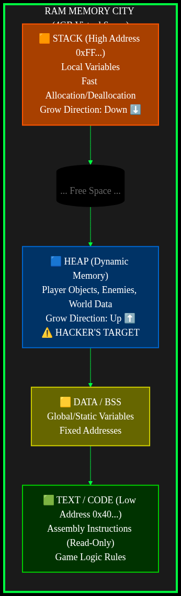
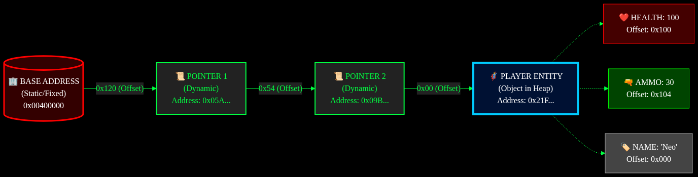

# LỜI NÓI ĐẦU

Chào mừng tân binh đến với khóa huấn luyện Game Hacking khắc nghiệt nhất.
Cuốn sách này không dạy bạn cách phá hoại. Nó dạy bạn cách làm chủ công nghệ.

---
## 📑 MỤC LỤC (Table of Contents)
${toc}

---

# 🏴‍☠️ Chương 1: Tư Duy Hacker (The Mindset)

> *"Tôi không dạy bạn cách dùng tool. Tôi dạy bạn cách máy tính suy nghĩ. Khi bạn hiểu máy tính, bạn là Chúa."*

---

## 🛑 SỨ MỆNH (MISSION BRIEFING)
Chào mừng tân binh. Bạn đang đứng trước cánh cổng của thế giới ngầm (Underground).
Nhiệm vụ của chương này không phải là hack game ngay. Nhiệm vụ của bạn là **"Mở Mắt"**.
Bạn phải nhìn thấy ma trận số (Matrix) đằng sau những hình ảnh đồ họa lung linh.

**Mục tiêu:**
1.  Hiểu **RAM** hoạt động như thế nào (Chiến trường chính).
2.  Đọc hiểu **Hexadecimal** (Ngôn ngữ của máy).
3.  Nắm vững **Con Trỏ (Pointer)** (Bản đồ kho báu).
4.  Tự tay code một **Dummy Game** để làm chuột bạch thí nghiệm.

---

## 1.1. Kho Vũ Khí (Weaponry Setup) 🛠️
Đi đánh trận mà tay không thì chỉ có "Feed mạng". Cài đặt ngay bộ 3 hủy diệt này:

1.  **Visual Studio 2022 (Community)**:
    *   *Là gì:* Lò rèn vũ khí. Nơi chúng ta viết code C/C++.
    *   *Link:* [Download](https://visualstudio.microsoft.com/vs/community/)
    *   *Lưu ý:* Khi cài nhớ tích chọn **"Desktop development with C++"**. Đừng cài nhầm VS Code (đó chỉ là Text Editor).

2.  **Cheat Engine (Bản mới nhất)**:
    *   *Là gì:* Kính hiển vi soi RAM.
    *   *Link:* [Download](https://www.cheatengine.org/)
    *   *Cảnh báo:* Antivirus sẽ la làng là virus. Kệ nó, tắt Antivirus đi. Hacker mà sợ virus à?

3.  **Process Hacker 2**:
    *   *Là gì:* Task Manager phiên bản "ngầu". Dùng để soi các tiến trình ẩn, tắt Anti-cheat.

---

## 1.2. Chiến Trường RAM (The Battlefield) 💾
Khi bạn bật game (CS2, LoL...), toàn bộ Game được load từ ổ cứng lên **RAM**.
Hacker không tấn công ổ cứng. Hacker tấn công **RAM**.

Hãy tưởng tượng **RAM** là một **Thành Phố Khổng Lồ**:
*   Mỗi **Byte** là một ngôi nhà.
*   Mỗi ngôi nhà có một **Số nhà (Address)** duy nhất. Ví dụ: `0x00400000`.
*   Bên trong ngôi nhà chứa **Cư dân (Value)**. Cư dân có thể là số Máu, số Đạn, hoặc tên nhân vật.

### 🗺️ Bản Đồ Thành Phố (Memory Layout)
Thành phố này được quy hoạch thành 4 quận chính. Bạn bắt buộc phải nhớ:



> **🧠 Ghi nhớ cốt tử:**
> *   Hack Máu/Đạn/Tiền: Chúng ta lùng sục ở **Heap**.
> *   Hack Bất tử/Nhìn xuyên tường (Logic): Chúng ta sửa đổi **Code (.text)**.

---

## 1.3. Ngôn Ngữ Của Máy (Hexadecimal) 🤖
Tại sao Hacker luôn viết `0xDEADBEEF` mà không viết số thường?

*   Bạn dùng hệ 10 (0-9).
*   Máy tính dùng hệ 2 (0-1).
*   **Hệ 16 (Hex)** là cầu nối hoàn hảo. 1 chữ số Hex đại diện chính xác cho 4 bit nhị phân. Gọn gàng, sexy.

**Bảng Chuyển Đổi Nhanh:**

| Thập phân (Dec) | Hex (0x) | Nhị phân (Bin) | Ý nghĩa |
| :--- | :--- | :--- | :--- |
| 0 | 0 | 0000 | Rỗng |
| 10 | A | 1010 | |
| 15 | F | 1111 | Full 4-bit |
| 255 | FF | 1111 1111 | Full 1 Byte (Max) |

> **Quy ước:** Bất cứ khi nào thấy tiền tố `0x`, hãy hiểu đó là số Hex.
> Ví dụ: Địa chỉ `0x123` không phải là một trăm hai mươi ba, mà là `1*256 + 2*16 + 3`.

---

## 1.4. Nhận Diện Mục Tiêu (Data Types) 🎯
Máy tính không biết "Máu" hay "Mana". Nó chỉ biết các ô nhớ vô hồn.
Để tìm được kẻ địch, bạn phải biết hắn trông như thế nào.

1.  **Byte (1 byte)**:
    *   *Dùng cho:* Levell, Team ID (1=Terrorist, 2=Counter), Boolean (0=False, 1=True).
    *   *Range:* 0 - 255.
2.  **Integer (4 bytes)**: **⚠️ QUAN TRỌNG NHẤT**
    *   *Dùng cho:* Máu, Đạn, Tiền, Giáp.
    *   *Range:* -2 tỷ đến +2 tỷ.
3.  **Float (4 bytes)**:
    *   *Dùng cho:* **Tọa độ (X, Y, Z)**, Tốc độ di chuyển, Góc nhìn.
    *   *Đặc điểm:* Có dấu chấm động (VD: `100.5f`).
4.  **Double (8 bytes)**:
    *   *Dùng cho:* Game Engine đời mới (Unreal 5) hoặc Game Web (JavaScript).
5.  **String**:
    *   *Dùng cho:* Tên nhân vật, Chat log.

---

## 1.5. Con Trỏ (Pointers) - Bản Đồ Kho Báu 🗺️
Đây là "Trùm Cuối" của mớ lý thuyết. Nếu vượt qua được nó, bạn đã thắng 50% game.

**Vấn đề:**
Game hiện đại có cơ chế **ASLR** (Address Space Layout Randomization).
Mỗi lần khởi động game, Windows sẽ tráo đổi vị trí các ngôi nhà trên RAM.
Hôm nay địa chỉ Máu là `0x1000`, mai nó nhảy sang `0x9999`.

**Giải pháp:**
Game cũng sợ lạc mất Máu. Nên Game luôn giữ một tờ giấy ghi địa chỉ Máu hiện tại. Tờ giấy đó gọi là **Con Trỏ (Pointer)**.
Con trỏ thường nằm ở một vị trí **Tĩnh (Static)** không bao giờ đổi (thường là trong file `.exe` hoặc `.dll`).

**Mô hình truy tìm kho báu:**


Hacker dùng Cheat Engine để **Pointer Scan** - Dò ngược từ Kho báu về Tòa thị chính để tìm ra con đường này.

---

## 1.6. Nhiệm Vụ Thực Hành: Tạo Dummy Game 🎮
Bạn không thể hack nếu không biết game được tạo ra thế nào.
Hãy code một con game giả lập bằng C++ để làm "bao cát" cho chúng ta tập luyện.

### Bước 1: Code `DummyGame.cpp`
Copy đoạn code này vào Visual Studio và chạy (F5).

```cpp
#include <iostream>
#include <windows.h>
#include <vector>

// Cấu trúc nhân vật trong game
struct Player {
    int id;             // 4 bytes
    char name[32];      // 32 bytes
    int health;         // 4 bytes (Mục tiêu của chúng ta!)
    int ammo;           // 4 bytes
    float posX, posY;   // 8 bytes
};

int main() {
    SetConsoleTitleA("Dummy Game - Targeted by VTech");
    std::cout << ">>> GAME INIT... <<<" << std::endl;

    // Cấp phát nhân vật trên HEAP (Vùng nhớ động)
    // Đây là lý do địa chỉ thay đổi mỗi lần chạy
    Player* myPlayer = new Player();
    
    // Gán chỉ số ban đầu
    myPlayer->id = 777;
    strcpy_s(myPlayer->name, "Neo");
    myPlayer->health = 100;
    myPlayer->ammo = 30;
    myPlayer->posX = 150.5f;

    // In địa chỉ ra để "nhá hàng" (Game thật không bao giờ có dòng này!)
    std::cout << "[DEBUG] Player Struct Address: 0x" << std::hex << (uintptr_t)myPlayer << std::endl;
    std::cout << "[DEBUG] Health Address:        0x" << std::hex << (uintptr_t)&myPlayer->health << std::endl;
    std::cout << "------------------------------------------------" << std::endl;

    while (true) {
        // Game Loop
        std::cout << "Player: " << myPlayer->name 
                  << " | HP: " << std::dec << myPlayer->health 
                  << " | Ammo: " << myPlayer->ammo 
                  << " | Pos: " << myPlayer->posX << std::endl;

        // Logic game: Tự mất máu theo thời gian
        if (myPlayer->health > 0) {
            myPlayer->health -= 1; 
        } else {
            std::cout << ">>> GAME OVER (YOU DIED) <<<" << std::endl;
            // Hồi sinh
            std::cout << "Respawning..." << std::endl;
            myPlayer->health = 100;
        }

        Sleep(1000); // Nghỉ 1 giây
    }
    
    delete myPlayer;
    return 0;
}
```

### Bước 2: Thử Nghiệm
1.  Chạy `DummyGame.exe`.
2.  Mở **Cheat Engine**.
3.  Kết nối vào Process `DummyGame.exe`.
4.  Thử tìm giá trị `health` xem nào? (Nó bắt đầu từ 100 và giảm dần).

> **Gợi ý:** Nếu bạn tìm ra, hãy thử "Freeze" (Đóng băng) nó. Nếu Console của game cứ in ra `HP: 100` mãi mãi mặc dù game đang trừ máu -> **BẠN ĐÃ THÀNH CÔNG!** 🎉

---

[Tiếp theo: Chương 2 - Hacker's Swiss Knife (Cheat Engine)](../02_Cong_Cu_Than_Thanh/README.md)


<div style="page-break-after: always;"></div>

# ⚔️ Chương 2: Làm Chủ Cheat Engine (Weapon Mastery)

> *"Cheat Engine không chỉ là tool hack. Nó là kính hiển vi, là dao mổ, và là khẩu súng bắn tỉa của mọi Game Hacker."*

---

## 🛑 SỨ MỆNH (MISSION BRIEFING)
Ở Chương 1, bạn đã biết RAM là chiến trường.
Ở Chương này, bạn sẽ học cách sử dụng vũ khí tối thượng: **Cheat Engine (CE)**.

Đừng lầm tưởng CE chỉ dùng để chỉnh tiền game offline. Các kỹ thuật `Scan`, `Debugger`, `Disassembler` của nó là nền tảng cho mọi tool hack cao cấp sau này (kể cả hack game online).

**Mục tiêu:**
1.  Hiểu cơ chế **Lọc (Filtering)** của CE.
2.  Thành thạo 3 kỹ thuật Scan tử thần: **Exact Value**, **Unknown Initial Value**, **Floating Point**.
3.  Biết cách tạo **Cheat Table (.CT)** để lưu trữ chiến công.

---

## 2.1. Cơ Chế Hoạt Động (The Logic) 🧠
Làm sao CE tìm được đúng địa chỉ máu trong đống hỗn độn hàng tỷ byte của RAM?
Nó dùng phương pháp **LOẠI TRỪ (Elimination)**.


1.  **First Scan:** Quét toàn bộ RAM xem ai có giá trị `100` (giả sử máu là 100). Có thể tìm ra 1 triệu kết quả.
2.  **Change:** Bạn vào game, để quái đánh còn `90` máu.
3.  **Next Scan:** Bảo CE "Trong 1 triệu thằng kia, thằng nào giờ biến thành 90?".
4.  **Repeat:** Lặp lại cho đến khi chỉ còn 1 kẻ sống sót. Đó là địa chỉ máu.

---

## 2.2. Kỹ Thuật 1: Exact Value Scan (Xạ Thủ) 🔫
Dùng khi bạn **nhìn thấy số cụ thể** trên màn hình (Máu, Đạn, Tiền).

**Bài Tập:** Hack Đạn trong `DummyGame` (hoặc Tutorial Step 2 của CE).

**Quy Trình Tác Chiến:**
1.  **Nhập số đạn hiện tại** (VD: 30) vào ô `Value`.
2.  Chọn `Scan Type` = **Exact Value**.
3.  Chọn `Value Type` = **4 Bytes** (Chuẩn công nghiệp).
4.  Bấm **First Scan**. (Kết quả: Hàng ngàn địa chỉ).
5.  Vào game bắn 1 viên (Đạn còn 29).
6.  Nhập `29` vào ô `Value` -> Bấm **Next Scan**.
7.  Lặp lại cho đến khi còn dưới 5 địa chỉ.
8.  Kéo xuống dưới (Cheat Table), sửa Value thành `9999`.
9.  Vào game bắn thử. Nếu đạn không giảm hoặc tăng lên 9999 -> **HEADSHOT!** 🎯

---

## 2.3. Kỹ Thuật 2: Unknown Initial Value (Truy Vết) 👣
Dùng khi bạn **không biết số cụ thể** (Thanh máu dạng thanh trượt, không hiện số).

**Quy Trình Tác Chiến:**
1.  Chọn `Scan Type` = **Unknown initial value**.
2.  Bấm **First Scan**. (CE sẽ ghi nhớ toàn bộ RAM hiện tại).
3.  Vào game, để mất một ít máu.
4.  Chọn `Scan Type` = **Decreased value** (Giá trị đã giảm).
5.  Bấm **Next Scan**.
6.  Vào game, đứng yên hồi máu (hoặc bơm máu).
7.  Chọn `Scan Type` = **Increased value**.
8.  Bấm **Next Scan**.
9.  Lặp lại (Decreased/Increased/Unchanged) cho đến khi tìm ra.

> **Mẹo:** Nếu thanh máu đầy, quét Scan Type = **Changed value** liên tục cũng là một cách hay.

---

## 2.4. Kỹ Thuật 3: Floating Point (Bắn Tỉa Tọa Độ) 📡
Dùng cho **Máu (dạng %)** hoặc **Tọa độ (X, Y, Z)**.
Máy tính lưu số thực (có dấu chấm) khác hoàn toàn số nguyên.

**Quy Trình:**
*   Đổi `Value Type` từ `4 Bytes` sang **Float**.
*   Các bước Scan y hệt như Exact Value.
*   **Lưu ý:** Nếu Scan Float không ra, hãy thử **Double**. (Game xịn thường dùng Double cho tọa độ để bản đồ rộng không bị lỗi).

---

## 2.5. Memory Viewer & Pointers (Thâm Nhập Sâu) 🕵️‍♂️
Tìm được địa chỉ chưa phải là xong. Khởi động lại game là mất.
Chúng ta cần tìm **Con Trỏ (Pointer)** để hack vĩnh viễn.

1.  Chuột phải vào địa chỉ hack được -> **Pointer Scan for this address**.
2.  Chọn **Max Level** = 5 (Đừng tham quá, 5 tầng là đủ sâu).
3.  Bấm OK và chờ đợi.
4.  Sau khi Scan xong, tắt game bật lại.
5.  Vào bảng Pointer Scan -> **Rescan memory** -> Chọn process game mới.
6.  Những pointer nào vẫn trỏ đúng về máu -> Đó là **Pointer Xịn**.

---

## 🛑 NHIỆM VỤ VỀ NHÀ (HOMEWORK)
1.  Hoàn thành **Tutorial 1 đến 5** của Cheat Engine (Vào Help -> Cheat Engine Tutorial).
2.  Dùng `DummyGame.exe` ở chương 1:
    *   Hack `Health` thành 99999.
    *   Hack `Ammo` thành vô hạn.
    *   Tìm Pointer của `Health` (Level nâng cao).

---

[Tiếp theo: Chương 3 - External Hacking (C++ Project đầu tiên)](../03_Lap_Trinh_External/README.md)


<div style="page-break-after: always;"></div>

# 🩸 Chương 3: External Hacking (First Blood)

> *"Dùng Cheat Engine là đi mượn kiếm. Tự code Trainer là tự rèn kiếm cho riêng mình."*

---

## 🛑 SỨ MỆNH (MISSION BRIEFING)
Bạn đã biết tìm địa chỉ bằng Cheat Engine. Nhưng bạn không thể bắt khách hàng của mình tải Cheat Engine về rồi làm thủ công từng bước được.
Bạn cần đóng gói kỹ thuật đó vào một file `.exe` duy nhất. Bấm 1 nút -> Hack xong.

Đó gọi là **External Hacking**: Viết một phần mềm chạy *bên ngoài* game, dùng quyền Admin thò tay vào sửa RAM của game.

**Mục tiêu:**
1.  Hiểu quy trình **OpenProcess**.
2.  Sử dụng thuần thục 2 hàm WinAPI thần thánh: `ReadProcessMemory` (RPM) và `WriteProcessMemory` (WPM).
3.  Code một **Trainer C++** hoàn chỉnh hack `DummyGame`.

---

## 3.1. Quy Trình Xâm Nhập (Infiltration Flow) 🕵️‍♂️
Windows bảo vệ các Process rất nghiêm ngặt. Process A không thể tự tiện sửa Process B.
Để làm được điều đó, Hacker phải xin một cái "Chìa khóa" (Handle) từ hệ điều hành.


1.  **Find Window:** Tìm cửa sổ game để lấy `Process ID` (PID).
2.  **OpenProcess:** Dùng PID để xin Windows cấp quyền truy cập (`PROCESS_ALL_ACCESS`).
3.  **Read/Write:** Dùng Handle đã xin được để Đọc/Ghi RAM.

---

## 3.2. Vũ Khí C++ (The Arsenal) 🧰

### `FindWindowA`
Tìm cửa sổ game bằng tên Class hoặc tên Title.
```cpp
HWND hwnd = FindWindowA(NULL, "Dummy Game for Hacking");
```

### `GetWindowThreadProcessId`
Lấy số chứng minh thư (PID) của game.
```cpp
DWORD pid;
GetWindowThreadProcessId(hwnd, &pid);
```

### `OpenProcess`
Xin chìa khóa vào nhà.
```cpp
HANDLE hProcess = OpenProcess(PROCESS_ALL_ACCESS, FALSE, pid);
```

### `WriteProcessMemory` (WPM)
Cú đấm quyết định. Ghi đè giá trị mới vào địa chỉ cũ.
```cpp
int newHealth = 9999;
WriteProcessMemory(hProcess, (LPVOID)0xDEADBEEF, &newHealth, sizeof(newHealth), NULL);
```

---

## 3.3. Thực Hành: Code Trainer Đầu Tiên (Project: FirstBlood) 🩸
Hãy tạo một project C++ mới tên là `SimpleTrainer`.

**Yêu cầu:** Đã chạy `DummyGame.exe` và dùng Cheat Engine tìm ra địa chỉ Health (Ví dụ: `0x00EFF690` - *Lưu ý: Địa chỉ máy bạn sẽ khác, hãy thay thế vào code*).

```cpp
#include <iostream>
#include <windows.h> // Thư viện chứa các hàm WinAPI

int main() {
    SetConsoleTitleA("Simple External Trainer");
    std::cout << ">>> WAITING FOR GAME... <<<" << std::endl;

    // 1. Tìm cửa sổ Game
    HWND hwnd = FindWindowA(NULL, "Dummy Game - Targeted by VTech");
    if (hwnd == NULL) {
        std::cout << "[-] Khong tim thay game! Hay bat DummyGame.exe truoc." << std::endl;
        return 0;
    }
    std::cout << "[+] Da tim thay cua so Game!" << std::endl;

    // 2. Lấy PID
    DWORD pid;
    GetWindowThreadProcessId(hwnd, &pid);
    std::cout << "[+] Process ID: " << pid << std::endl;

    // 3. Mở Process (Xin quyền truy cập)
    HANDLE hProcess = OpenProcess(PROCESS_ALL_ACCESS, FALSE, pid);
    if (hProcess == NULL) {
        std::cout << "[-] Khong the mo Process. Hay chay Admin!" << std::endl;
        return 0;
    }
    std::cout << "[+] OpenProcess Success! Handle: " << hProcess << std::endl;

    // 4. Hack Loop
    // Thay địa chỉ này bằng địa chỉ bạn tìm được từ Cheat Engine!!
    uintptr_t healthAddr = 0x00EFF690; 
    int cheatVal = 9999;

    while (true) {
        if (GetAsyncKeyState(VK_F1) & 1) { // Nếu bấm F1
            // Ghi đè máu
            WriteProcessMemory(hProcess, (LPVOID)healthAddr, &cheatVal, sizeof(cheatVal), NULL);
            std::cout << "[!] HACKED: Set Health -> 9999" << std::endl;
            Beep(1000, 100); // Kêu Bíp cho ngầu
        }
        Sleep(50); // Nghỉ nhẹ để đỡ ngốn CPU
    }

    CloseHandle(hProcess);
    return 0;
}
```

---

## 🛑 NHIỆM VỤ (TOP SECRET)
1.  Code lại ví dụ trên.
2.  Thay địa chỉ `healthAddr` đúng với máy của bạn.
3.  Chạy Trainer và bấm **F1** để xem `DummyGame` có hồi máu không.
4.  **Thử thách:** Thêm tính năng Hack Ammo (Đạn) vào phím **F2**.

---

[Tiếp theo: Chương 4 - Internal Hacking (Tiêm DLL - Kỹ thuật thượng thừa)](../04_Lap_Trinh_Internal/README.md)


<div style="page-break-after: always;"></div>

# 💉 Chương 4: Internal Hacking (Gián Điệp Kiểu Mẫu)

> *"External Hacker giống như lính bắn tỉa: An toàn nhưng bị giới hạn. Internal Hacker giống như điệp viên: Nguy hiểm, nằm ngay trong lòng địch, nhưng quyền lực là vô hạn."*

---

## 🛑 SỨ MỆNH (MISSION BRIEFING)
Ở Chương 3, bạn đã làm Trainer External. Nhưng External có điểm yếu:
1.  **Chậm:** Phải dùng `ReadProcessMemory` liên tục (giao tiếp giữa 2 process tốn thời gian).
2.  **Hạn chế:** Không thể vẽ Menu lên màn hình game (ESP), không thể sửa đổi logic game phức tạp (Hook).

Giải pháp: **Internal Hacking**.
Chúng ta sẽ không đứng ngoài nữa. Chúng ta sẽ chui tọt vào bên trong Game.

**Mục tiêu:**
1.  Hiểu cơ chế **DLL Injection** (Tiêm thuốc độc).
2.  Tự viết một **Injector** đơn giản.
3.  Tự viết một **DLL Hack** đầu tiên (MessageBox "Hello World" từ bên trong Game).

---

## 4.1. Giải Phẫu DLL Injection 🧬
Làm thế nào để nhét code của mình (C++) vào trong file Game (`.exe`) đang chạy mà không cần source code game?
Windows cung cấp một cửa hậu: **LoadLibrary**.


1.  **Injector (Bác sĩ):** Tool do chúng ta viết.
2.  **Target (Bệnh nhân):** Game process.
3.  **DLL (Thuốc):** Code hack của chúng ta, được biên dịch thành file `.dll` (Dynamic Link Library).

**Quy trình tiêm:**
Injector sẽ dùng quyền Admin, trỏ súng vào đầu Game và ra lệnh: *"Ê, tao vừa copy cái file `hack.dll` vào bộ nhớ của mày đấy. Chạy nó ngay cho tao!"* (thông qua hàm `CreateRemoteThread`).

---

## 4.2. Chế Tạo Thuốc (DLL Payload) 💊
Tạo Project mới trong Visual Studio: `Dynamic-Link Library (DLL)`.

**Code `dllmain.cpp`:**
Đây là nơi code sẽ chạy ngay lập tức khi tiêm thành công.

```cpp
#include <windows.h>
#include <iostream>

// Luồng hack chính (Chạy song song với Game)
DWORD WINAPI HackThread(LPVOID lpParam) {
    // 1. Mở Console để debug (Sướng hơn External nhiều!)
    AllocConsole();
    FILE* f;
    freopen_s(&f, "CONOUT$", "w", stdout);

    std::cout << ">>> INTERNAL HACK INJECTED! <<<" << std::endl;
    std::cout << "Ban dang o trong long dich (In-Process Memory)." << std::endl;
    std::cout << "Base Address: 0x" << std::hex << (uintptr_t)GetModuleHandle(NULL) << std::endl;

    // 2. Hack Loop (Truy cập trực tiếp, không cần ReadProcessMemory!)
    // Giả sử địa chỉ Máu là con trỏ: 0x123456 (Thay cái này bằng Pointer xịn nhé)
    int* pHealth = (int*)0x00EFF690; 

    while (true) {
        if (GetAsyncKeyState(VK_END) & 1) { // Bấm END để thoát
            break;
        }

        if (GetAsyncKeyState(VK_F1) & 1) {
            *pHealth = 9999; // Gán trực tiếp! Siêu nhanh!
            std::cout << "[!] Health set to 9999" << std::endl;
        }
        
        Sleep(10);
    }

    // 3. Dọn dẹp & Rút quân
    fclose(f);
    FreeConsole();
    FreeLibraryAndExitThread((HMODULE)lpParam, 0);
    return 0;
}

// Cửa ngõ của DLL
BOOL APIENTRY DllMain(HMODULE hModule, DWORD  ul_reason_for_call, LPVOID lpReserved) {
    switch (ul_reason_for_call) {
    case DLL_PROCESS_ATTACH:
        // Khi vừa tiêm vào, tạo ngay 1 luồng riêng để chạy hack
        CreateThread(nullptr, 0, HackThread, hModule, 0, nullptr);
        break;
    case DLL_PROCESS_DETACH:
        break;
    }
    return TRUE;
}
```

---

## 4.3. Chế Tạo Kim Tiêm (The Injector) 💉
Tạo Project mới: `Console App (C++)`.

```cpp
#include <iostream>
#include <windows.h>
#include <TlHelp32.h>

// Hàm lấy PID theo tên Game
DWORD GetProcId(const char* procName) {
    DWORD procId = 0;
    HANDLE hSnap = CreateToolhelp32Snapshot(TH32CS_SNAPPROCESS, 0);
    if (hSnap != INVALID_HANDLE_VALUE) {
        PROCESSENTRY32 procEntry;
        procEntry.dwSize = sizeof(procEntry);
        if (Process32First(hSnap, &procEntry)) {
            do {
                if (!_stricmp(procEntry.szExeFile, procName)) {
                    procId = procEntry.th32ProcessID;
                    break;
                }
            } while (Process32Next(hSnap, &procEntry));
        }
    }
    CloseHandle(hSnap);
    return procId;
}

int main() {
    const char* dllPath = "D:\\MyHacks\\SimpleHack.dll"; // Sửa đường dẫn này!
    const char* procName = "DummyGame.exe";
    
    // 1. Lấy PID
    DWORD procId = 0;
    while (!procId) {
        procId = GetProcId(procName);
        std::cout << "Waiting for game..." << std::endl;
        Sleep(1000);
    }

    // 2. Mở Process
    HANDLE hProc = OpenProcess(PROCESS_ALL_ACCESS, 0, procId);
    if (hProc && hProc != INVALID_HANDLE_VALUE) {
        // 3. Cấp phát bộ nhớ trong Game để chứa đường dẫn DLL
        void* loc = VirtualAllocEx(hProc, 0, MAX_PATH, MEM_COMMIT | MEM_RESERVE, PAGE_READWRITE);
        
        // 4. Ghi đường dẫn DLL vào đó
        WriteProcessMemory(hProc, loc, dllPath, strlen(dllPath) + 1, 0);
        
        // 5. Ép Game gọi LoadLibraryA để load DLL
        CreateRemoteThread(hProc, 0, 0, (LPTHREAD_START_ROUTINE)LoadLibraryA, loc, 0, 0);
        
        std::cout << ">>> INJECTED SUCCESSFULLY! <<<" << std::endl;
        CloseHandle(hProc);
    }
    return 0;
}
```

---

## 4.4. Hooking - Nghệ Thuật Đánh Tráo (Advanced) 🎣
Tiêm được DLL vào rồi thì làm gì? Hack máu chỉ là trò trẻ con.
Cao thủ sẽ dùng **Hooking**.

**Nguyên lý:**
Game có hàm `DrawPlayer()`. 
Hacker sẽ sửa code của hàm đó, chèn thêm lệnh `DrawBox()` của mình vào.
-> Kết quả: Game vừa vẽ nhân vật, vừa vẽ thêm cái khung hình chữ nhật bao quanh (Wallhack/ESP).

Thư viện nổi tiếng nhất: **MinHook**. (Chúng ta sẽ học sâu ở chương sau).

---

## 🛑 NHIỆM VỤ (MISSION)
1.  Build file `.dll` hack (nhớ chọn đúng x86/x64 khớp với game).
2.  Build file `.exe` injector.
3.  Chạy Game -> Chạy Injector.
4.  Nếu thấy cửa sổ Console đen hiện lên **bên trong game** -> Chúc mừng, bạn đã trở thành Internal Hacker!

---

[Tiếp theo: Chương 5 - Mobile Hacking (Android/iOS)](../05_Mobile_Hacking/README.md)


<div style="page-break-after: always;"></div>

# 📱 Chương 5: Mobile Hacking (Chiến Trường Bỏ Túi)

> *"PC là pháo đài. Mobile là chiến trường du kích. Nhỏ hơn, chật hẹp hơn, nhưng khốc liệt gấp đôi."*

---

## 🛑 SỨ MỆNH (MISSION BRIEFING)
Thời đại của PC vẫn còn đó, nhưng Mobile mới là mỏ vàng (PUBG Mobile, Liên Quân, Free Fire).
Hack trên mobile có 2 trường phái:
1.  **Non-Root (Mod Menu):** Sửa file `.apk`/`.ipa` rồi cài lại. Dành cho người dùng phổ thông.
2.  **Root/Jailbreak:** Can thiệp sâu vào hệ thống, dùng GameGuardian hoặc Tweak. Dành cho Hacker thực thụ.

**Mục tiêu:**
1.  Hiểu kiến trúc **ARM** (Khác hoàn toàn x86 trên PC).
2.  Làm chủ **GameGuardian** (Cheat Engine phiên bản Mobile).
3.  Làm quen với **Frida** (Vua của Dynamic Instrumentation).

---

## 5.1. Chiến Trường Mobile (The Architecture) 🗺️
Khác với PC (dùng chip Intel/AMD x86), điện thoại dùng chip **ARM** (Advanced RISC Machine).
Tập lệnh Assembly của nó khác. Cách quản lý bộ nhớ cũng khác.


*   **Root (Android) / Jailbreak (iOS):** Điều kiện tiên quyết để can thiệp sâu. Nếu không có quyền này, bạn chỉ là "khách" trên chính thiết bị của mình.
*   **GameGuardian (GG):** Một ứng dụng nhưng lại có quyền truy cập RAM của ứng dụng khác (Game). Nó hoạt động y hệt Cheat Engine.
*   **Server-Side Check:** Game Mobile thường online 100%. Hack Máu/Tiền thường là **Fake** (chỉ mình thấy, server không nhận). Hack Tọa độ/Wallhack/Aimbot (Client-side) mới là chân ái.

---

## 5.2. GameGuardian - Vũ Khí Du Kích 👾
Đây là công cụ mạnh nhất trên Android.

**Quy trình tác chiến:**
1.  **Select Process:** Chọn game đang chạy (Lưu ý: Game mobile hay có nhiều process con, chọn cái nào nặng MB nhất).
2.  **Select Memory Range:** Chọn `Ca` (C++ alloc) và `A` (Anonymous). Đây là nơi chứa dữ liệu Game (Heap). Bỏ qua `Video`, `Code App`.
3.  **Search:**
    *   **Dword:** Máu, Đạn.
    *   **Float:** Tọa độ (X, Y, Z).
    *   **Encrypted (Xor):** Nhiều game mã hóa giá trị (VD: Máu thật là 100, nhưng trong RAM nó lưu là `100 ^ Key`). GG có chế độ Search Encrypted để tự dò Key.

**Scripting (Lua):**
GameGuardian hỗ trợ viết script bằng **Lua**. Bạn có thể viết một script tự động:
*   Tìm địa chỉ máu.
*   Sửa thành 9999.
*   Vẽ menu UI đơn giản ngay trên màn hình game.

---

## 5.3. Modding APK/IPA (Phẫu Thuật Thẩm Mỹ) 💉
Nếu không muốn Root máy, bạn phải sửa file cài đặt.

**Android (APK):**
1.  **Decompile:** Dùng `APKTool` để bung file `.apk` ra thành code `Smali` (một dạng Assembly của Java) và tài nguyên.
2.  **Inject Lib:** Chép file `hack.so` (C++) của mình vào thư mục `lib/`.
3.  **Hook Load:** Sửa file `MainActivity.smali` để gọi lệnh `System.loadLibrary("hack")` khi khởi động.
4.  **Recompile & Sign:** Đóng gói lại thành APK mới và ký chữ ký số (Sign).

**iOS (IPA):**
1.  Tương tự nhưng phức tạp hơn vì cơ chế bảo mật của Apple cực gắt.
2.  Thường dùng **Theos** để viết Tweak (`.dylib`) rồi tiêm vào IPA bằng `Azule` hoặc `Sideloadly`.

---

## 5.4. Frida - Vua Của Dynamic Hacking 👑
Nếu PC có Cheat Engine, thì Mobile có **Frida**.
Nó cho phép bạn viết code **JavaScript** trên PC để điều khiển logic game trên điện thoại theo thời gian thực (qua cáp USB).

**Ví dụ Script Frida (.js):**
```javascript
Java.perform(function() {
    // Tìm hàm get_Health trong class Player
    var PlayerClass = Java.use("com.game.Player");
    
    PlayerClass.get_Health.implementation = function() {
        console.log("[Frida] Game đang lấy chỉ số máu...");
        return 99999; // Trả về máu ảo luôn!
    };
});
```
-> Chạy script này phát, vào game auto bất tử. Không cần compile lại APK, không cần restart game.

---

## 🛑 NHIỆM VỤ (MISSION)
1.  Cài đặt giả lập **LDPlayer** hoặc **Bluestacks** (đã Root).
2.  Cài **GameGuardian**.
3.  Tải một game offline nhẹ (VD: Hill Climb Racing).
4.  Dùng GameGuardian hack tiền (Coins) trong game đó.

---

[Tiếp theo: Chương 6 - Reverse Engineering Advanced (Dịch ngược nâng cao)](../06_Reverse_Engineering_Advanced/README.md)


<div style="page-break-after: always;"></div>

# 🧩 Chương 6: Reverse Engineering (Giải Mã Ma Trận)

> *"Lập trình viên viết Code để tạo ra phần mềm. Reverse Engineer đọc phần mềm để tìm lại Code. Chúng ta là những kẻ đi ngược thời gian."*

---

## 🛑 SỨ MỆNH (MISSION BRIEFING)
Đến lúc này, bạn đã biết hack những game đơn giản có sẵn mã nguồn hoặc không bị mã hóa.
Nhưng thế giới thực khốc liệt hơn nhiều. Game online xịn (PUBG, Valorant) không bao giờ đưa source code cho bạn. Chúng chỉ đưa cho bạn một file `.exe` cục mịch.

Nhiệm vụ của bạn: **Dịch ngược (Reverse)** file `.exe` đó trở lại thành logic mà con người hiểu được, để tìm lỗ hổng.

**Mục tiêu:**
1.  Hiểu quy trình **Disassembly** và **Decompilation**.
2.  Đọc hiểu sơ đẳng **Assembly (x64)** - Ngôn ngữ mẹ đẻ của CPU.
3.  Làm quen với **IDA Pro** - "Thánh khí" của giới Reverse.

---

## 6.1. Quy Trình Dịch Ngược (The Pipeline) 🔄
Máy tính không hiểu C++/C#/Python. Nó chỉ hiểu **Machine Code** (0 và 1).
Khi lập trình viên bấm "Build", Code C++ sẽ bị xay nát thành Machine Code.
Reverse Engineering là quá trình cố gắng "ráp" đống vụn vặt đó lại nguyên hình.


*   **Assembly (ASM):** Là bản dịch thô của Machine Code. Rất dài dòng, khó hiểu, nhưng chính xác 100%.
*   **Pseudocode (C++ giả):** Là phỏng đoán của Tool (IDA Hex-Rays) về logic gốc. Dễ đọc hơn ASM nhiều, nhưng có thể sai.

---

## 6.2. Nhập Môn Assembly x64 (Ngôn Ngữ Của Chúa) 📜
Đừng sợ. Bạn không cần phải viết ASM, bạn chỉ cần **đọc hiểu** nó.

### Các Thanh Ghi (Registers) - "Túi đồ của CPU"
CPU không có RAM. Nó chỉ có các hộc tủ nhỏ gọi là Register để tính toán cho nhanh.
*   `RAX`: Thanh ghi chính (Chứa kết quả trả về của hàm, kết quả cộng trừ...).
*   `RCX, RDX, R8, R9`: Chứa 4 tham số đầu tiên gửi vào hàm (Theo chuẩn Windows x64).
*   `RIP`: Con trỏ lệnh (Instruction Pointer) - Chỉ vào dòng lệnh sắp chạy tiếp theo. **Hack luồng game là sửa cái này.**
*   `RSP`: Con trỏ Stack.

### Các Lệnh Cơ Bản (Instructions)
1.  `MOV A, B` 👉 **Copy**: Chép giá trị B vào A. (A = B)
2.  `ADD A, B` 👉 **Cộng**: A = A + B.
3.  `SUB A, B` 👉 **Trừ**: A = A - B.
4.  `CMP A, B` 👉 **So sánh**: So A với B xem bằng hay lớn hơn.
5.  `JE Address` 👉 **Nhảy nếu bằng (Jump Equal)**: Nếu phép so sánh trên là Bằng, nhảy tới Address.
6.  `JNE Address` 👉 **Nhảy nếu không bằng (Jump Not Equal)**.
7.  `CALL Address` 👉 **Gọi hàm**.

**Ví dụ thực tế:**
Logic Game (C++):
```cpp
if (Health <= 0) {
    Die();
}
```

Dịch sang Assembly:
```asm
CMP [Health], 0    ; So sánh Máu với 0
JG  Living         ; Jump Greater: Nếu lớn hơn 0 thì nhảy tới nhãn "Living" (Sống tiếp)
CALL Die           ; Nếu không nhảy -> Gọi hàm Chết
Living:
...
```

> **Mẹo Hack:** Hacker sẽ sửa lệnh `JG` (Jump Greater) thành `JMP` (Jump Always - Luôn luôn nhảy).
> -> Kết quả: Dù máu = 0 hay -100, game vẫn nhảy tới "Sống tiếp" -> **BẤT TỬ.** 🧛‍♂️

---

## 6.3. IDA Pro - Kính Chiếu Yêu 🧿
IDA Pro là phần mềm đắt đỏ và mạnh mẽ nhất thế giới RE.
(Nhưng chắc bạn sẽ dùng bản "thuốc" thôi, tôi biết mà).

**Các phím tắt sinh tồn trong IDA:**
*   **SPACE:** Chuyển đổi giữa chế độ Text (Code thuần) và Graph (Sơ đồ khối). **Luôn dùng Graph** để dễ nhìn luồng đi (Flowchart).
*   **F5:** Thần chú! Tự động dịch Assembly sang C++ giả (Pseudocode). Giúp bạn hiểu hàm này làm gì trong 1 nốt nhạc.
*   **X (Xref):** Tìm xem hàm/biến này được gọi ở đâu. (Ví dụ: Tìm xem chỗ nào gọi hàm `TruTien` để chặn lại).
*   **N:** Đổi tên hàm/biến (Rename). Đặt tên gợi nhớ (VD: `sub_401000` -> `CheckPassword`) để đỡ bị rối.

---

## 6.4. Bài Tập Thực Hành (Lab 3) 🕵️
**Mục tiêu:** Crack chương trình `CrackMe.exe` đơn giản (Tự code hoặc tải trên mạng).

1.  Viết một chương trình C++ nhỏ yêu cầu nhập Password. Nếu đúng in "Success", sai in "Fail".
2.  Mở file `.exe` đó bằng IDA Pro.
3.  Tìm chuỗi "Fail" (Shift + F12 để mở bảng Strings).
4.  Double click vào chuỗi "Fail" để nhảy tới vùng nhớ chứa nó.
5.  Bấm `X` để xem lệnh nào đang sử dụng chuỗi này.
6.  Nhìn lên trên lệnh đó, bạn sẽ thấy lệnh `CMP` (So sánh pass) và `JZ/JNZ` (Nhảy).
7.  **Patch:** Sửa lệnh Nhảy đó để dù nhập sai nó vẫn nhảy vào nhánh "Success".
    *   (Trong IDA Pro: Edit -> Patch program -> Assemble).

---

## 6.5. ARM Assembly (Mobile) - Khác Biệt Nhỏ 📱
Trên Mobile (Android/iOS), chip ARM dùng tập lệnh khác xíu:
*   `R0 - R15`: Các thanh ghi (Thay vì RAX, RBX).
*   `MOV`, `ADD`, `SUB`: Giống PC.
*   `B` (Branch): Giống `JMP` (Nhảy).
*   `BL` (Branch with Link): Giống `CALL` (Gọi hàm).

Tuy khác tên, nhưng tư duy Logic (So sánh -> Nhảy) là y hệt.

---

[Tiếp theo: Chương 7 - Networking & Packet Hacking (Hack Game Online)](../07_Networking_Packet_Hacking/README.md)


<div style="page-break-after: always;"></div>

# 📡 Chương 7: Networking & Packet Hacking (Bắt Cóc Tin Nhắn)

> *"Trên PC, RAM là vua. Trên Internet, Packet (Gói tin) là chúa. Ai kiểm soát được Packet, người đó kiểm soát thực tại."*

---

## 🛑 SỨ MỆNH (MISSION BRIEFING)
Hack RAM (Client-side) chỉ có tác dụng với những thứ hiển thị trên máy bạn (Wallhack, NoRecoil).
Nhưng Tiền, Level, Vật phẩm... đều nằm trên **Server**. Bạn sửa RAM máy bạn thành 1 tỷ vàng, Server nó cười vào mặt bạn rồi reload lại số cũ.

Để hack được tài sản, bạn phải tấn công đường truyền.
Bạn phải chặn đứng lá thư (Packet) gửi đi từ máy bạn, sửa nội dung bức thư đó, rồi mới gửi cho Server.

**Mục tiêu:**
1.  Hiểu mô hình **Client-Server**.
2.  Thực hiện kỹ thuật **Man-In-The-Middle (MITM)**.
3.  Sử dụng **Wireshark** và **WPE Pro** để bắt và sửa gói tin.

---

## 7.1. Kiến Trúc Mạng (The Matrix Grid) 🌐
Khi bạn chơi game online, máy tính của bạn (Client) và máy chủ (Server) nói chuyện với nhau liên tục bằng các gói tin (Packet).

*   **Client:** "Tao vừa bắn thằng kia." (Gửi Packet).
*   **Server:** "Để tao check... Ừ đúng, nó chết rồi." (Trả Packet).
*   **Client:** "Ok, tao hiện animation nó ngã xuống."

Nếu Hacker chặn được Packet đầu tiên và sửa thành *"Tao vừa bắn thằng kia Headshot"* -> Server sẽ tin sái cổ (nếu không check kỹ).


---

## 7.2. Wireshark - Máy X-Quang Gói Tin 🦴
Wireshark không dùng để hack, nó dùng để **NHÌN**.
Nó bắt toàn bộ dữ liệu đi qua card mạng của bạn.

**Quy trình soi:**
1.  Mở Wireshark -> Chọn mạng (Ethernet/WiFi).
2.  Vào game, thực hiện hành động (VD: Mua một bình máu).
3.  Ra Wireshark, dừng bắt (Stop).
4.  Lọc packet: `ip.addr == [IP Server Game]`.
5.  Tìm packet nào chứa dữ liệu khả nghi.

**Vấn đề:** Game hiện đại dùng **HTTPS/SSL** hoặc mã hóa gói tin (Encryption). Wireshark sẽ chỉ thấy một đống giun dế vô nghĩa.
-> Lúc này cần MITM Proxy.

---

## 7.3. WPE Pro / Winsock Packet Editor (Huyền Thoại Cổ Đại) ⚔️
Đây là tool hack packet "quốc dân" thời Mu Online, Gunbound, Võ Lâm.
Nó không bắt ở card mạng. Nó móc (Hook) vào hàm `send()` và `recv()` của API Windows ngay trong game.
Do đó, nó bắt được gói tin **TRƯỚC KHI** bị mã hóa (đối với một số game cũ/cùi bắp).

**Kỹ thuật Filter:**
*   Tìm chuỗi byte đại diện cho hành động bắn súng. Ví dụ: `0A 01 00`.
*   Tạo Filter: Cứ thấy `0A 01 00` thì tự động đổi thành `0A 02 00` (Skill mạnh hơn).
*   Vào game bắn thường -> Server nhận được Skill cuối.

---

## 7.4. Man-In-The-Middle (MITM) Hiện Đại 🕵️‍♂️
Với game mobile (Android/iOS) dùng HTTPS, chúng ta dùng **Charles Proxy** hoặc **Fiddler**.

1.  Cài Charles Proxy trên PC.
2.  Trên điện thoại, set Wifi Proxy trỏ về IP của PC.
3.  Cài Certificate của Charles lên điện thoại để giải mã HTTPS.
4.  Vào game. Charles sẽ hiện rõ mồn một các API game gọi lên server.
    *   `POST /api/buy_item`
    *   `{"item_id": 101, "price": 500}`
5.  **Breakpoint:** Chuột phải vào request -> Breakpoints.
6.  Vào game mua lại. Charles sẽ dừng request đó lại trước khi gửi đi.
7.  Sửa `price: 500` thành `price: 1`.
8.  Execute.
9.  -> Nếu Server ngu ngơ, bạn vừa mua đồ xịn với giá 1 đồng. 💸

---

## 🛑 BÀI TẬP THỰC TẾ (LAB 7)
1.  Tải **Fiddler Classic** (PC).
2.  Mở một web game đơn giản (HTML5) hoặc client game cũ.
3.  Thử bắt gói tin đăng nhập (Login packet).
4.  Xem bạn có thấy Username/Password của mình dưới dạng Plaintext không? (Nếu có, game đó bảo mật kém).

---

[Tiếp theo: Chương 8 - Kernel Driver (Vùng Đất Cấm)](../08_Kernel_Driver_Development/README.md)


<div style="page-break-after: always;"></div>

# ☠️ Chương 8: Kernel Driver (Vùng Đất Cấm)

> *"Ở Ring 3, nếu bạn sai, chương trình Crash. Ở Ring 0, nếu bạn sai, cả hệ điều hành sụp đổ (Blue Screen of Death)."*

---

## 🛑 SỨ MỆNH (MISSION BRIEFING)
Tại sao chúng ta phải mạo hiểm xuống Kernel?
Vì **Anti-Cheat** (Vanguard, EasyAntiCheat, BattlEye) đều nằm ở đó.
Khi bạn dùng `ReadProcessMemory` ở User Mode (Ring 3), Anti-Cheat ở Kernel (Ring 0) sẽ nhìn thấy và chặn ngay lập tức. "Mày tuổi gì mà đòi sờ vào game của tao?".

Muốn đánh bại Anti-Cheat, bạn phải ngang hàng với nó. Bạn phải viết **Kernel Driver**.

**Mục tiêu:**
1.  Hiểu kiến trúc **Ring 0 vs Ring 3**.
2.  Hiểu sự nguy hiểm của **BSOD**.
3.  Viết một **Driver Hello World** đơn giản.

---

## 8.1. Kiến Trúc Ring (The Hierarchy) 👑
CPU Intel/AMD chia quyền lực thành 4 vòng tròn (Rings). Windows chỉ dùng 2 vòng:


*   **Ring 3 (User Mode):** Nơi ở của dân thường (Chrome, Word, Game, và các tool hack gà mờ). Bạn làm gì ở đây cũng bị Ring 0 giám sát.
*   **Ring 0 (Kernel Mode):** Nơi ở của Thượng đế (Windows Kernel, Drivers card màn hình, và Anti-Cheat). Ở đây, bạn có thể truy cập **mọi địa chỉ RAM** của bất kỳ process nào mà không cần xin phép.

**Anti-Cheat hoạt động thế nào?**
Nó cài một Driver (.sys) vào Ring 0. Nó đăng ký các hàm Callback:
> *"Bất kỳ ai (Ring 3) định mở Handle vào process Game, hãy báo cho tao. Tao sẽ tước quyền ngay lập tức."*
User Mode Hacker -> ☠️ Bất lực.

---

## 8.2. Rủi Ro (The Blue Screen of Death) 🟦
Quyền lực càng lớn, trách nhiệm càng cao.
Trong Ring 3, nếu code bạn lỗi (`Null Pointer`), chỉ có tool của bạn tắt ngúm.
Trong Ring 0, nếu code bạn lỗi, **Windows sẽ dừng hoạt động ngay lập tức** để bảo vệ phần cứng. Màn hình xanh chết chóc (BSOD) hiện ra. Máy khởi động lại.

> **Quy tắc số 1:** Test Driver trên máy ảo (VMware/VirtualBox) trước khi chạy thật. Đừng bao giờ code Driver trên máy chính nếu không muốn mất dữ liệu.

---

## 8.3. Chế Tạo Driver Đầu Tiên (Hello World .sys) 🚗
Bạn cần cài đặt **Visual Studio** và **WDK (Windows Driver Kit)**.

Tạo Project: `Kernel Mode Driver, Empty (KMDF)`.

**Code `Driver.c`:**

```c
#include <ntddk.h>

// Hàm dọn dẹp khi tắt Driver (Bắt buộc phải có, nếu không sẽ không tắt được Driver)
void DriverUnload(PDRIVER_OBJECT pDriverObject) {
    UNREFERENCED_PARAMETER(pDriverObject);
    DbgPrint(">>> Hacker: Bye bye Kernel! Safe landing. <<<\n");
}

// Hàm chính (Giống main() trong C++)
NTSTATUS DriverEntry(PDRIVER_OBJECT pDriverObject, PUNICODE_STRING pRegistryPath) {
    UNREFERENCED_PARAMETER(pRegistryPath);

    pDriverObject->DriverUnload = DriverUnload;

    DbgPrint(">>> Hacker: HELLO RING 0! Power Overwhelming! <<<\n");

    return STATUS_SUCCESS;
}
```

**Biên dịch:** Bấm Build -> Bạn sẽ nhận được file `MyDriver.sys`.
File này **không thể chạy bằng cách double click**.

---

## 8.4. Load Driver (Nhập Tịch Ring 0) 🛡️
Windows 10/11 mặc định cấm load Driver không có chữ ký số (Unsigned Driver) để chống virus.
Để load driver "cây nhà lá vườn" của chúng ta, bạn phải bật chế độ **Test Mode**.

1.  Mở CMD (Admin).
2.  Gõ: `bcdedit /set testsigning on`
3.  Restart máy. (Bạn sẽ thấy chữ "Test Mode" ở góc màn hình).

**Dùng Tool load:**
Sử dụng **OSR Loader** hoặc **KDU** để load file `.sys` vào hệ thống.
Sau khi load, dùng **DebugView** (của Sysinternals) để xem dòng log `>>> Hacker: HELLO RING 0!`.

Nếu thấy nó -> Chúc mừng, bạn đã đặt chân vào thánh địa Kernel!

---

## 🛑 Cảnh Báo Cuối Cùng
Viết Driver Hack Game là vi phạm EULA nghiêm trọng và có thể bị kiện.
Kiến thức này chỉ để học tập và hiểu về OS Internals.
Các Anti-Cheat hiện tại (Vanguard) chạy ngay từ khi boot máy. Cuộc chiến ở Ring 0 rất khốc liệt và đẫm máu (BSOD liên tục).

---

[Tiếp theo: Chương 9 - Anti-Cheat Evasion (Trốn Tìm)](../09_Anti_Cheat_Evasion/README.md)


<div style="page-break-after: always;"></div>

# 👻 Chương 9: Anti-Cheat Evasion (Nghệ Thuật Tàng Hình)

> *"Hack đuợc game là Dũng. Hack mà không bị ban là Trí. Vừa hack vừa không bị ban suốt 10 năm là Thánh."*

---

## 🛑 SỨ MỆNH (MISSION BRIEFING)
Bạn đã có súng (Cheat Engine), có kiếm (Internal Hook), có xe tăng (Kernel Driver).
Nhưng kẻ địch (Anti-Cheat) có Radar.
Nếu bạn bật hack lên và 5 phút sau tài khoản "bay màu", thì mọi kỹ thuật bạn học đều vô nghĩa.

**Mục tiêu:**
1.  Hiểu cơ chế phát hiện của Anti-Cheat (Static, Dynamic, Behavioral).
2.  Học cách làm rối mã (Obfuscation) để chống quét tĩnh.
3.  Học cách giả lập hành vi người thật (Humanizer) để chống quét hành vi.

---

## 9.1. Anti-Cheat Hoạt Động Thế Nào? 🛡️
Anti-Cheat (AC) không phải phép thuật. Nó là một chương trình máy tính, và nó hoạt động dựa trên các quy tắc.


1.  **Static Analysis (Quét Tĩnh):** AC đọc file `.exe` hoặc `.dll` hack của bạn trên đĩa. Nó so sánh mã hash (MD5/SHA256) hoặc tìm các chuỗi ký tự đặc trưng (String Scanning).
    *   *Ví dụ:* Nếu trong file hack của bạn có chữ "Cheat Engine" -> BAN.
2.  **Dynamic Analysis (Quét Động):** AC quét RAM khi game đang chạy. Nó tìm các cửa sổ lạ, các luồng (Thread) lạ, hoặc các đoạn code bị tiêm vào (Injection Detect).
3.  **Behavioral Analysis (Hành Vi):** AC (Server-side) theo dõi thống kê.
    *   *Ví dụ:* Tỉ lệ Headshot của bạn là 99%? -> BAN. Chuột của bạn di chuyển một đường thẳng tắp (Aimbot)? -> BAN.

---

## 9.2. Kỹ Thuật Né Tránh (Evasion Arts) 🥷

### 1. Junk Code & Polymorphism (Biến Hình)
Để chống Static Scan (Signature), mỗi lần build hack, file `.exe` phải khác nhau hoàn toàn.
*   **Junk Code:** Chèn thêm các đoạn code vô nghĩa vào.
    ```cpp
    // Code rác
    int a = 123;
    for(int i=0; i<100; i++) a += i;
    // Code hack thật
    HackHealth();
    ```
*   **VMProtect / Themida:** Dùng các phần mềm Packer thương mại để mã hóa file hack mỗi lần một khác.

### 2. String Encryption (Giấu Chữ)
Tuyệt đối không để chuỗi "Hack", "Trainer", "Health" dạng Plaintext trong file.
*   **Xấu:** `FindWindowA(NULL, "Counter-Strike")`
*   **Tốt:** Mã hóa chuỗi "Counter-Strike" thành `XorStr("Nbujufs-Strjlf")`. Khi chạy mới giải mã ra.

### 3. Humanizer (Giả Người)
Để chống Behavioral Scan (Aimbot), đừng bao giờ aim thẳng vào đầu ngay lập tức (Snap).
*   **Smoothing:** Di chuyển tâm từ từ.
*   **Random Bone:** Lúc bắn đầu, lúc bắn ngực, lúc bắn trượt (quan trọng!).
*   **Reaction Time:** Thêm độ trễ. Người thường cần 200ms để phản xạ, đừng bắn ngay 1ms sau khi địch xuất hiện.

---

## 9.3. HWID Spoofer (Đường Lui Cuối Cùng) 🎭
Nếu lỡ bị Ban, AC thường Ban luôn phần cứng (HWID: Mainboard, HDD, MAC Address).
Để chơi lại, bạn cần **Spoofer**.
*   Spoofer là một Kernel Driver làm giả thông tin phần cứng trả về cho AC.
*   Hỏi Serial ổ cứng? -> Trả về số Random.
*   Hỏi MAC Address? -> Trả về số Random.

---

## 🛑 BÀI TẬP TƯ DUY (MIND GAME)
Hãy tưởng tượng bạn là lập trình viên Anti-Cheat.
Làm sao để phát hiện một người chơi đang dùng Wallhack (nhìn xuyên tường)?
1.  Chụp ảnh màn hình (Screenshot) máy người chơi gửi về Server? -> Hacker sẽ vẽ Wallhack lên lớp phủ (Overlay) không bị chụp.
2.  Kiểm tra xem người chơi có ngắm vào địch đang núp sau tường không? -> Nếu aiming xuyên tường quá nhiều lần -> Flag.

Hãy luôn tư duy hai chiều: **Hacker vs Security Dev.**

---

[Tiếp theo: Chương 10 - The Road Ahead (Lời Kết & Tài Nguyên)](../10_Loi_Ket/README.md)


<div style="page-break-after: always;"></div>

# 🏁 Chương 10: Lời Kết & Lộ Trình (The Road Ahead)

> *"Kết thúc khóa huấn luyện không phải là hết. Nó là sự khởi đầu."*

---

## 🛑 TỔNG KẾT CHIẾN DỊCH (DEBRIEFING)
Chúc mừng Tân binh! 🎉
Bạn đã sống sót qua 9 chương huấn luyện khắc nghiệt nhất. Từ một người chỉ biết tải tool về dùng, bạn đã đi qua:
1.  **Tư duy (Mindset):** Hiểu RAM là chiến trường.
2.  **Công cụ (Tools):** Thành thạo Cheat Engine.
3.  **Lập trình (Coding):** Tự viết Trainer External & Internal.
4.  **Kỹ thuật (Techniques):** Hooking, DLL Injection, Reverse Engineering.
5.  **Vùng cấm (Forbidden Zone):** Mobile Hacking & Kernel Driver.

Bạn không còn là "Script Kiddie" nữa. Bạn đã nắm trong tay sức mạnh để thay đổi thực tại của Game.

---

## 10.1. Bản Đồ Năng Lực (Skill Tree) 🗺️
Hành trình của một Game Hacker (Security Researcher) chia làm các cấp độ. Bạn đang ở đâu?


*   **Level 0-1:** Hầu hết game thủ dừng lại ở đây.
*   **Level 2-3:** Bạn đã có thể tự làm tool hack bán kiếm tiền (nhưng đừng làm thế!).
*   **Level 4-5:** Bạn có thể làm việc cho các công ty bảo mật (Red Team).
*   **Level 6:** Đỉnh cao. Bạn có thể viết Anti-Cheat hoặc khai thác lỗ hổng Zero-day.

---

## 10.2. Đạo Đức & Pháp Luật (The Code) ⚖️
Sức mạnh lớn đi kèm trách nhiệm lớn.
*   **Black Hat (Mũ Đen):** Phá hoại game, bán hack, làm hỏng trải nghiệm người khác. -> **Kết cục:** Bị kiện, đi tù, cộng đồng khinh rẻ.
*   **White Hat (Mũ Trắng):** Nghiên cứu lỗ hổng, báo cáo cho nhà phát hành (Bug Bounty), viết Anti-Cheat. -> **Kết cục:** Được tôn trọng, lương cao, sự nghiệp bền vững.

> **Lời khuyên:** Hãy dùng kiến thức này để HỌC tập (Reverse Engineering), không phải để PHÁ hoại.

---

## 10.3. Tài Nguyên Tiếp Theo (Reinforcements) 📚
Dừng lại là chết. Công nghệ thay đổi từng giờ.

**Cộng Đồng (Forums):**
1.  **UnknownCheats (.me):** Thánh địa của Game Hacking thế giới. Mọi source code xịn nhất đều từ đây ra. (Hãy đọc, đừng chỉ copy).
2.  **GuidedHacking (.com):** Nơi có các tutorial video cực kỳ chi tiết (có trả phí).

**Sách Gối Đầu Giường:**
1.  *Practical Malware Analysis* (Michael Sikorski).
2.  *Reversing: Secrets of Reverse Engineering* (Eldad Eilam).
3.  *Rootkits and Bootkits* (Alex Matrosov).

---

## 🛑 LỜI TẠM BIỆT (DISMISSED)
Cuốn sách này chỉ là tấm bản đồ. Con đường đi tiếp là do bạn chọn.
Hãy giữ cái đầu lạnh và trái tim nóng.

**Hẹn gặp lại ở Ring 0.**

*Signed,*
**VTech Digital Solution**
*(a.k.a Antigravity)*

---
*(Hết)*


<div style="page-break-after: always;"></div>

# 📖 Từ Điển Thuật Ngữ (Glossary)

Dành cho những thuật ngữ chuyên ngành được sử dụng trong sách **[VN] CheatDev Book**.

## A
*   **Address (Địa chỉ):** Vị trí cụ thể của dữ liệu trong RAM (VD: `0x00400000`).
*   **ASLR (Address Space Layout Randomization):** Cơ chế bảo mật của HĐH, ngẫu nhiên hóa vị trí module mỗi khi chạy game để chống hack cứng (Hardcoded Address).
*   **Assembly (ASM):** Ngôn ngữ lập trình bậc thấp, ánh xạ trực tiếp với mã máy.

## B
*   **Base Address:** Địa chỉ bắt đầu của một Module (file .exe hoặc .dll) trong bộ nhớ.
*   **Breakpoint:** Điểm dừng. Lệnh cho Debugger dừng chương trình lại tại một dòng code để kiểm tra.

## C
*   **Class:** Khuôn mẫu dữ liệu trong lập trình hướng đối tượng (C++).
*   **Code Cave:** Các vùng trống trong bộ nhớ (do căn chỉnh bộ nhớ) mà Hacker có thể chèn code vào.

## D
*   **DLL Injection:** Kỹ thuật tiêm một file Dynamic Link Library (.dll) vào tiến trình game để chạy code của mình trong đó.
*   **DMA (Dynamic Memory Allocation):** Cấp phát bộ nhớ động (Heap). Nơi chứa dữ liệu thay đổi liên tục.

## E
*   **ESP (Extra Sensory Perception):** Hack nhìn xuyên tường. Hiển thị thông tin (Máu, Tên, Khung xương) lên màn hình.
*   **External Hack:** Tool hack chạy như một tiến trình riêng biệt, dùng Windows API để đọc/ghi bộ nhớ game.

## H
*   **Heap:** Vùng nhớ dùng để chứa các biến động (Object, Nhân vật) được cấp phát bằng `new` hoặc `malloc`.
*   **Hexadecimal (Hex):** Hệ thập lục phân (cơ số 16), dùng để biểu diễn địa chỉ bộ nhớ ngắn gọn.
*   **Hooking:** Kỹ thuật chặn và chuyển hướng dòng lệnh của một hàm trong game sang hàm của Hacker.

## I
*   **IDA Pro:** Trình Disassembler chuyên nghiệp nhất thế giới, dùng để phân tích tĩnh (Static Analysis).
*   **IL2CPP (Intermediate Language to C++):** Công nghệ của Unity, chuyển code C# sang C++ để tăng hiệu năng (và làm khó Hacker).
*   **Internal Hack:** Code hack chạy bên trong bộ nhớ game (thường là DLL).

## K
*   **Kernel (Ring 0):** Nhân hệ điều hành. Nơi có quyền hạn cao nhất. Anti-Cheat thường chạy ở đây.

## O
*   **Offset:** Khoảng cách từ vị trí bắt đầu (Base) đến vị trí cần tìm. VD: `Address = Base + Offset`.
*   **Overlay:** Một cửa sổ trong suốt nằm đè lên game để vẽ ESP.

## P
*   **Pointer (Con trỏ):** Một biến chứa địa chỉ của biến khác.
*   **Pointer Chain:** Một chuỗi các con trỏ trỏ đến nhau (A trỏ B, B trỏ C, C trỏ Máu). Dùng để tìm địa chỉ thật sau mỗi lần game restart.

## R
*   **ReClass:** Công cụ giúp khôi phục cấu trúc Class (Struct) từ bộ nhớ thô.
*   **RPM (ReadProcessMemory):** Hàm Windows API để đọc RAM.

## S
*   **Signature Scanning (SigScan):** Kỹ thuật tìm vị trí hàm trong bộ nhớ dựa trên một chuỗi byte đặc trưng (Pattern) thay vì địa chỉ cố định.
*   **Stack:** Vùng nhớ ngăn xếp, chứa biến cục bộ và địa chỉ trả về của hàm.

## W
*   **WPM (WriteProcessMemory):** Hàm Windows API để ghi đè RAM.
